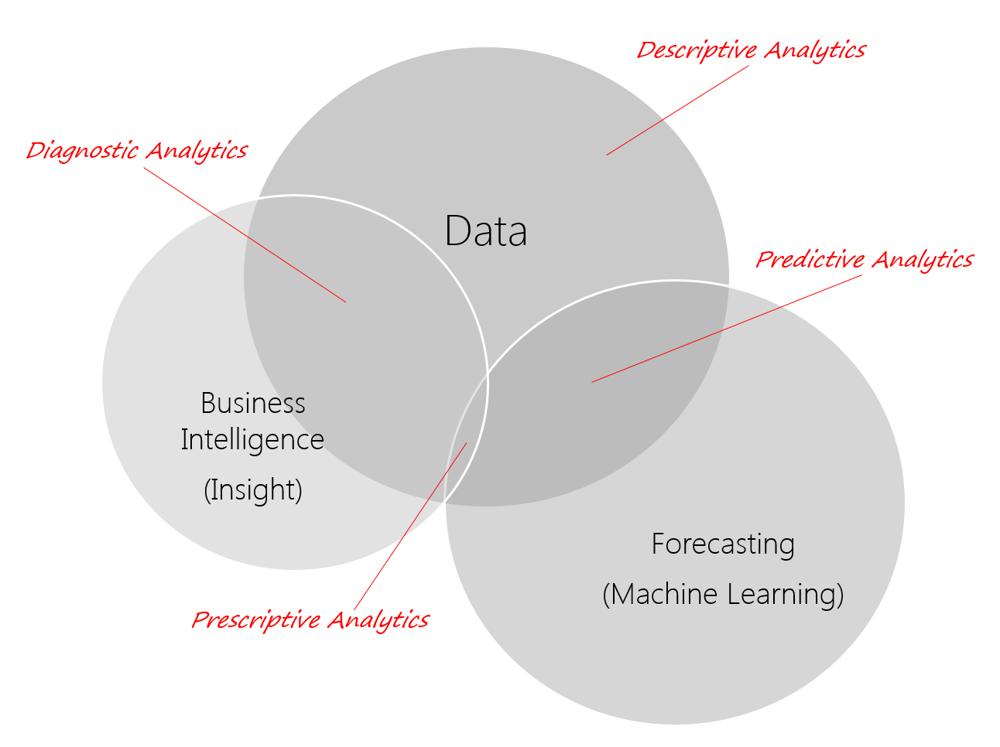

_Cross-posted: [**LinkedIn**](https://www.linkedin.com/pulse/4-stages-data-analytics-maturity-challenging-gartners-taras-kaduk/)_

If you happen to work in analytics, data science or business intelligence, you've probably seen one of the iterations of this Gartner's graph on stages of data analysis in a company:

The figure above shows various stages of analytics maturity, from "descriptive" to "prescriptive". I've seen it so many times, it became an eyesore to me.

There is nothing wrong with it. This look nicely breaks down the evolution of analytics into understandable parts and pairs each stage with a question to be answered: *what happened, why did it happen, what will happen, how can we make it happen*. And exactly this cadence of words *what, why, what, how* is what made me think that the relation between the 4 stages is not exactly linear.

In my mind, the *what* questions (descriptive and predictive analytics) can simply be answered by what's in the data: either existing historical data (descriptive analytics) or historical data, extrapolated into the future using machine learning techniques and forecasting (predictive analytics). You can easily move from one stage to another. There is no "diagnostic analytics" step in between.

*Why* and *how* (diagnostic and prescriptive analytics), on the other hand, are the questions that can be answered with existing data and a dash of business intelligence, either manual (a person going over the numbers and figuring things out), or baked in (an algorithm analyzing the numbers and producing verdicts based on models ran). In other words, both **diagnostic** and **prescriptive** analytics build on top of **descriptive** and **predictive** analytics respectively.

So, another way to visualize the connection between the four times would look something like this:

One issue with the following graph is that it doesn't fully show all the ways that *data + insight + machine learning* produce 4 flavors of analytics. And hence the good ol' venn diagram:

Every company's approach to analytics and data science is still unique: there are very few best practices known in the industry, and we all are still figuring it out. Similarly, every analyst's view on data analytics evolution and maturity will be different, and many of my colleagues will disagree with this view. And that is fine. We are still in the early stages of learning how to cook the proverbial spaghetti, and therefore let's not rob ourselves of the joy of throwing stuff from the pot onto the wall and seeing what sticks.