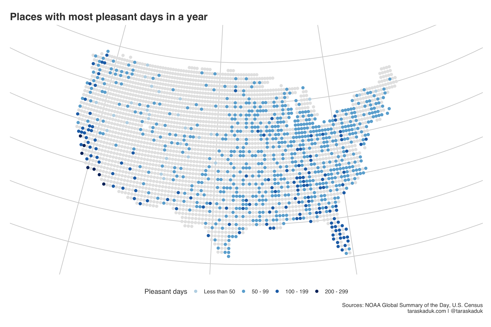
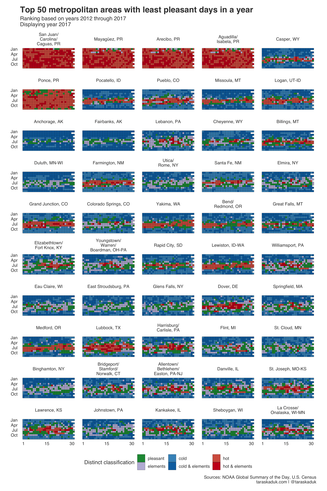
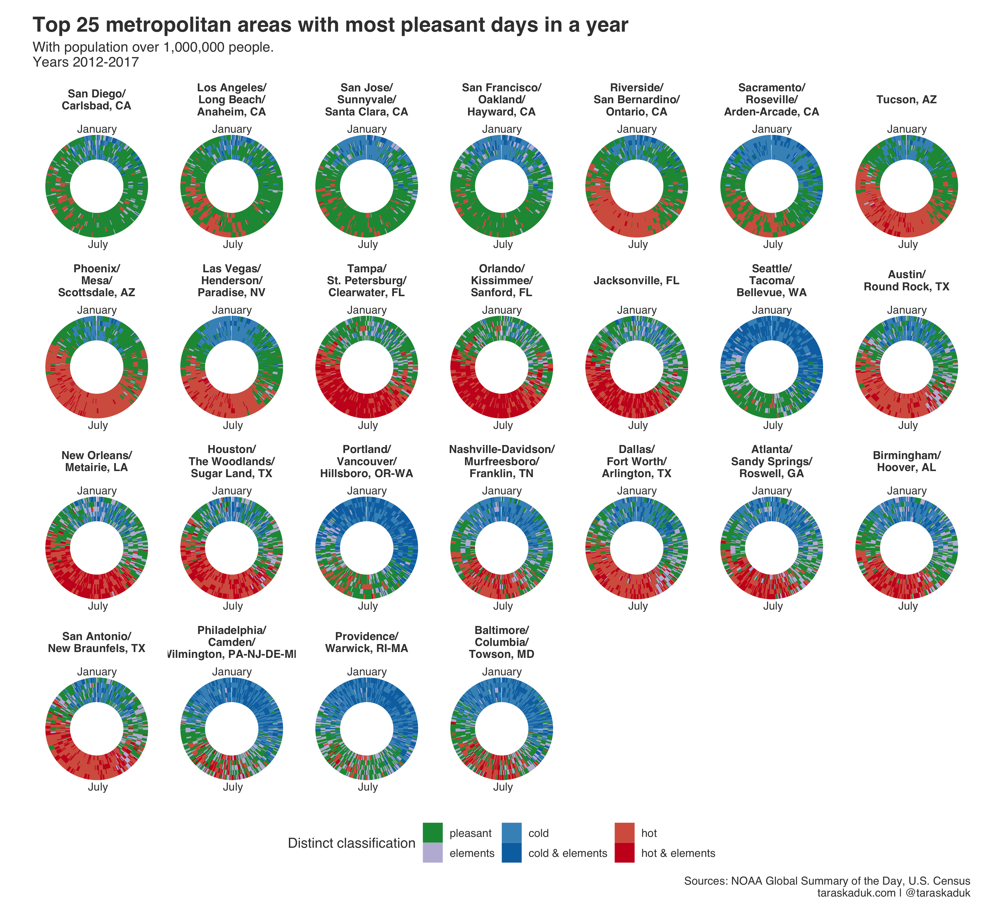
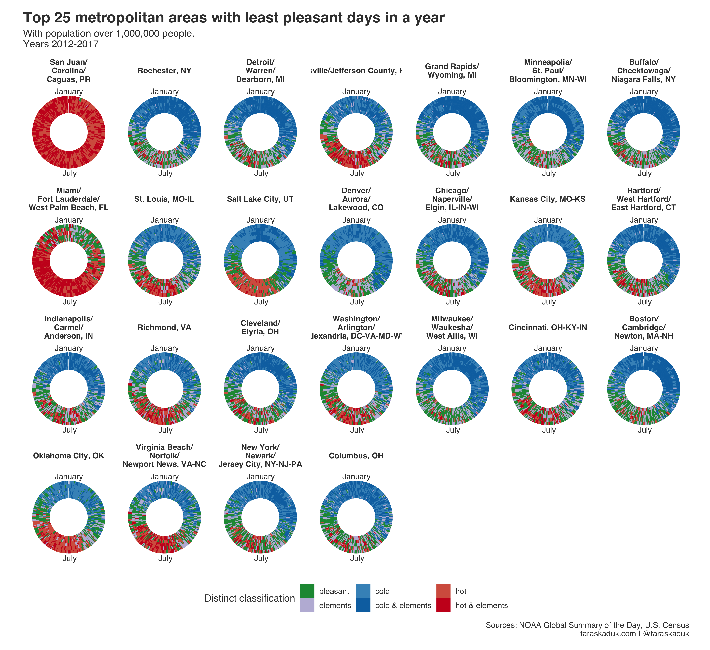

## Preface

**TL;DR**
 
*This analysis has been poisoning my life for over a year. Here are some nice charts. Now I can move on.*

I've been working on this project for way too long. I think I wrote the first line of code on it in November 2017. Well, it is February 2019 now, so... Yeah.
Over the course of the year, this hydra has grown many heads. It started simple, but escalated quickly. But I kept going at it because:

- this is a part of a larger project that is still on my list
- I wanted to get this one finished before I move to one of the many other projects I have in mind.

Well, last week I realized I'd had enough. Refactoring has gone wrong, some scripts stopped executing, and I had no patience to fix it. All this with the realization that I'm "shooting sparrows with a cannon" (a Russian expression. Don't ask): 

- I pull raw files from NOAA's FTP server instead of using `rnoaa` of `GSODR` packages.
- I use `sp` and `sf` objects where one center point per location would suffice
- I run predictive modeling to plug a few holes in the data instead of accepting the `NA`s as they are.

With a few of my scripts broken, I feel the need to publish some couple of results "as is" and move on to the next thing. (Especially since I'll be re-writing all this in simpler terms from scratch later anyway).
So, without further ado...

---

## Intro
I've [moved around a bit](https://taraskaduk.com/2017/11/26/pixel-maps/), and I always think about my next stop. There is a host of factors to consider, and I've seen quite a few cool online tools that, for example, help you determine your ideal country based on your political views, preferences and whatnot. But what about a domestic move? With a country as large and diverse as the United States, there are many places here that are quite different from one another.

About a year ago or so, I saw this [amazing weather map by Kelly Norton](https://kellegous.com/j/2014/02/03/pleasant-places/) showing the locations by the amount of pleasant days in a year. And it got me thinking: weather is an important factor in determining where to live (growing up in cold Ukraine, and later moving to hot Florida and rainy Seattle, I'm never happy with my weather). What I need is a tool to find the best place to live in the United States! Something like Kelly's map, but with more factors! Well, that sounds like a project I can do in R.

*Kelly's original map. Interactive and all. Check it out at [https://kellegous.com/j/2014/02/03/pleasant-places/](https://kellegous.com/j/2014/02/03/pleasant-places/)*

And so I decided to start with the weather. Since Kelly hasn't published his data or his methodology, I had to do everything by myself from scratch. Below is the brief methodology.

---

## Methodology

As stated in the preface, I'm publishing this and scraping this approach, while starting from scratch and hoping for a much cleaner and simple result next time. I won't publish the entire code, but I'll be glad to share specific bits and pieces of it.

After testing quite a few different approaches, I settled on the same data source that Kelly used: NOAA's Global Summary Of The Day database. I extracted years 2012 through 2017 *(I worked on the code in 2018, and so discarded 2018 as an incomplete year)* for all US-based weather stations, cleaned it up, filtered it out, did some averaging and very simple prediction to fill in a couple of values.

I then applied this data to 929 metropolitan and micropolitan statistical areas.
I really liked Kelly's idea of a "pleasant day", and so I used it in my ranking. I haven't found a good scientific definition of what a pleasant day is, but there are several takes on it on the intrawebs. Looking through all of the, I came to define a pleasant day as a day when:

- the max temperature was under 90 F but above 60 F
- the min temperature was above 40 F but under 70 F
- the mean temperature was between 55 F and 75 F
- no significant rain or snow (this part is very tricky as various weather stations record precipitations differently. This part was very important to me as I lived in Seattle for 2 years and I know the effect of constant rain on one's mood. I've spent a lot of time on this part, but the data is still far from perfect: precipitation doesn't seems to be reported as well as temperatures)

---

## The results
A picture is worth a thousand words, right?
With no code published, what do I have to offer? A couple of bitching visuals.

### Overall map

Inspired by the original post, I started with a map. I tried the World map first:
{}

Later, my analysis took down the path of keeping only the US locations. Mimicking the original map that inspired this analysis, I took a few liberties here and there: change the projection, indicate true NAs (uninhabited areas).

### 50 best and worst
Moving on to the rankings. Below is the chart design I settled on. Each chart shows 50 metropolitan and/or micropolitan areas, ranked by their average amount of pleasant days in years 2012-2017. The year 2017 is displayed for each area as a tile chart: months on y-axis, days of the month on x-axis. Areas are sorted according to the chart: from most to least in "most pleasant days", and from least to most in "least pleasant days": the most winner or loser is always on top

#### Top 50 best, all metropolitan and micropolitan

This is top 50 out of all areas for which there is data. Nothing surprising at the top, with California leading the way. Tennessee was a bit of a surprise to me (these smaller towns also don't seem to report a lot or any rain, which is suspicious). Also, it changed my frame of reference about Florida a bit: I live here now, and I consider it unpleasant (because it is very hot in the summer), but I must agree that our winters are very nice, and it looks like we've got it good compared to the rest of the country.

 
<a href="/posts/weather/50_most_all_5_cols_.png" target="_blank">[Full-size vertical version]</a> | <a href="/posts/weather/50_most_all_10_cols_.png" target="_blank">[Full-size horizontal version]</a> 

#### Top 50 worst, all metropolitan and micropolitan
In the "worst" section, we see all the usual suspects: Wyoming, Alaska, Montana, North Dakota. Also, Puerto Rico and Key West, FL are the only places that are too hot: the rest is too cold.

#### Top 50 best metro areas

Micropolitan areas are not always on everyone's mind, and therefore I wanted to look at metro areas specifically.
No surprise here either, with California and Florida having the 2/3 of top 50 metro areas. The first non-California metro area is Serbing, FL, 11th in the rank.

#### Top 50 worst metro areas
Over on the other side, not so pleasant places still include Puerto Rico and the Northern USA, but now we see a lot more of Eastern Washington and Oregon, along with that cold Northeast.

### Top 25 best and worst metro areas with population over 1,000,000 people

Finally, I ranked the biggest metro areas  - the ones with the population over 1 million - in the same way.
Here are 25 best and worst metro areas with over 1,000,000 people. This time, I used a different design, displaying all 6 years per metro area as "tree rings", using polar coordinates 

## Final thoughts

I feel very good about letting these imperfect charts out into the wild. Mostly, I feel liberated to be able to move on and do other things. Funny enough, one of these "other things" is to re-do this analysis, but keep it simpler and rely on existing packages rather than reinventing the wheel. Why re-do? Well, I still want to work on this project **"Best place to live"**, and weather is one important metric out of many. But this time around, I won't need all the precision, all the complexity, all the `ggplot` wizardry: I'll just accept a simple and somewhat imperfect metric as a proxy, as it will be one of many other numbers. So, stay tuned!