# Intro
I am convinced that many data scientists and data analysts acquire a peculiar reflex. Any time they suspect (consciuosly or subconsiously) that somewhere data is being collected, they develop an irresistable itch to analyze that data, oftentimes not even knowing where the data is!


After purchasing my first iPhone, I quickly realized that its Health app is capable of storing lots of data points. I looked at and analyzed some weight and steps data from my Android phone in the past, but this seemed like a whole new level.

I Googled around and found [this post](http://www.ryanpraski.com/apple-health-data-how-to-export-analyze-visualize-guide/) from [@ryanpraski](https://twitter.com/ryanpraski). The code was reproducible enough, and I ran it on my side, made a few changes and kind of left it.

Fast forward about 2 years, I got an Apple Watch, and got a lot more data points into my Health app. I also got a bit more serious about my workouts and my wellness, and started to rely on Health app data a lot. At one point, I even built out a small `patchwork` dashboard that helped me during my "bulking" and "cutting" phases: I tracked my weight, basal and active energy, calorie intake, daily amount of protein intake etc.

Long story short, I accumulated enough charts and ideas to put into a blog post and share them all with the world.
And so, without further ado...

# Get the data
Getting the data out of Health app is pretty easy. From Apple Health, you can export it anywhere. I save it right away into the Files, which instantly appears in my iCloud and is accessible from my Mac.

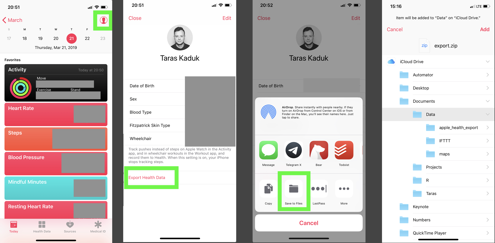

Your mileage may vary based on the path you chose to get the files. You could save it on the cloud, and then access via a web link, for instance. I find the iCloud storage synced up to your Mac being the most convenient solution.
Another thing you can do is to use a Shortcut to get the Health data in a different way. For example, there is [this shortcut here](https://www.icloud.com/shortcuts/db56d325085d4582aacc0e1b4bccf326), but you can write your own.

Anyway, back to our zip export. Now that the zip archive is on my Mac, you can break out an R session and start proding.

# Import

Before I forget, a few packages you'll need to replicate the analysis/charts are:

```r
library(XML)
library(tidyverse)
library(lubridate)
library(scales)
library(ggthemes)
```

The path to a folder on iCloud when synced up with the cloud looks funny.
You're better off creating an RStudio project and landing your archive right in that folder.
But just FYI, if you sync your Documents folder to iCloud and later want to reach the local files, the path would look like this:

```r
path <- '~/Library/Mobile\ Documents/com~apple~CloudDocs/Documents'
```
Anyhow, get that zip archive and unzip it
```r
zip <- paste(path, 'export.zip', sep = '/')
unzip(zip, exdir = path)
Sys.sleep(3) # pause for 3 seconds to let your computer unzip it.
```


Now that we unzipped the archive, we can work with the actual data. BTW, the contents of your unzipped folder will look something like this:

```r
> list.files(paste0(path,'/apple_health_export'))
[1] "clinical-records"   "electrocardiograms" "export_cda.xml"     "export.xml"
```

- `export.xml` is the data we'll be using primarily
- I'm not entirely clear on what `export_cda.xml` is: it seems to contain the data similar to `export.xml`, but I haven't had much luck completely parsing it. I understand CDA stands for [Clinical Document Architecture](http://www.hl7.org/implement/standards/product_brief.cfm?product_id=7) and is a special format to exchange these kinds of data.
- `electrocardiograms` is a folder where your Apple Watch ⌚️ ECGs are stored in csv format
- `clinical-records` is where external clinical results land (if you connected a clinic to your Apple Health did some lab work)

But we'll focus solely on `export.xml` file

First create an xml object containing all of the data as a starting point

```r
xml <- xmlParse(paste0(path, '/apple_health_export/export.xml'))
summary(xml)
```

```r
$nameCounts

                          Record                    MetadataEntry                         Location      InstantaneousBeatsPerMinute HeartRateVariabilityMetadataList 
                          469245                            73464                            50008                            18446                              456 
                    WorkoutEvent                          Workout                  ActivitySummary                      Correlation                     WorkoutRoute 
                             248                              133                              110                               71                               62 
                  ClinicalRecord                       ExportDate                       HealthData                               Me 
                              17                                1                                1                                1 

$numNodes
[1] 612263
```

Your mileage may vary based on the amount of data you store in Apple Health, and the amount of Apple devices that use Apple Health (iPhone alone or iPhone + Apple Watch⌚).
A brief rundown is the following:

- **Record** is the main place where the data is stored. Weight, height, blood pressure, steps, nutrition data, heart rate - all stored here
- **ActivitySummary** is your Apple Watch daily Activity stats: Move, Exercise, Stand data
- **Workout** is your Apple Watch workout activity per workout logged
- **Location** is your location logged during your Apple Watch workouts (useful for runs/hikes)
- **InstantaneousBeatsPerMinute** is exactly that: instantaneous heart rate when measured by AppleWatch
- **ExportDate** is useful to validate what data are you looking at.

The rest is either some matadata or something that I haven't found much use for (yet)
You can get the data into a clean nice data frame from each attribute with a simple function here:

```r
df_record <-   XML:::xmlAttrsToDataFrame(xml["//Record"])
df_activity <- XML:::xmlAttrsToDataFrame(xml["//ActivitySummary"])
df_workout <-  XML:::xmlAttrsToDataFrame(xml["//Workout"])
df_clinical <- XML:::xmlAttrsToDataFrame(xml["//ClinicalRecord"])
df_location <- XML:::xmlAttrsToDataFrame(xml["//Location"]) %>% 
  mutate(latitude = as.numeric(as.character(latitude)),
         longitude = as.numeric(as.character(longitude)))
```

Here are the `str()` calls to these data frames:

#### Record
```r
'data.frame':	527744 obs. of  9 variables:
 $ type         : Factor w/ 34 levels "HKQuantityTypeIdentifierActiveEnergyBurned",..: 4 4 28 7 7 7 7 7 7 7 ...
 $ sourceName   : Factor w/ 8 levels "Health","MyFitnessPal",..: 1 1 1 1 1 1 1 1 1 1 ...
 $ sourceVersion: Factor w/ 40 levels "1","10.2.1","10.3.1",..: 8 21 2 3 3 3 3 3 3 3 ...
 $ unit         : Factor w/ 14 levels "count","count/min",..: 8 8 3 6 6 6 6 6 6 6 ...
 $ creationDate : Factor w/ 190384 levels "2017-03-25 18:51:22 -0400",..: 3313 23291 54 226 239 256 275 342 356 382 ...
 $ startDate    : Factor w/ 340829 levels "2017-03-25 18:39:37 -0400",..: 9329 31933 159 634 672 711 768 967 999 1057 ...
 $ endDate      : Factor w/ 341207 levels "2017-03-25 18:46:21 -0400",..: 9326 31926 159 634 671 711 768 967 999 1057 ...
 $ value        : Factor w/ 77589 levels "0","0.000102795",..: 77165 77109 76024 65909 65912 65908 65563 65918 65918 65910 ...
 $ device       : Factor w/ 96622 levels "<<HKDevice: 0x282d00000>, name:Apple Watch, manufacturer:Apple, model:Watch, hardware:Watch4,1, software:5.0.1>",..: NA NA NA NA NA NA NA NA NA NA ...
```

#### Activity
```r
'data.frame':	130 obs. of  8 variables:
 $ dateComponents        : Factor w/ 130 levels "2018-11-04","2018-11-05",..: 1 2 3 4 5 6 7 8 9 10 ...
 $ activeEnergyBurned    : Factor w/ 128 levels "0","1017.62",..: 1 1 1 48 19 96 99 30 110 31 ...
 $ activeEnergyBurnedGoal: Factor w/ 4 levels "0","760","770",..: 1 1 1 2 2 2 2 2 2 2 ...
 $ activeEnergyBurnedUnit: Factor w/ 1 level "kcal": 1 1 1 1 1 1 1 1 1 1 ...
 $ appleExerciseTime     : Factor w/ 75 levels "0","1","10","102",..: 1 1 1 22 73 44 40 7 38 4 ...
 $ appleExerciseTimeGoal : Factor w/ 1 level "30": 1 1 1 1 1 1 1 1 1 1 ...
 $ appleStandHours       : Factor w/ 12 levels "0","10","11",..: 1 1 1 3 8 7 8 7 6 7 ...
 $ appleStandHoursGoal   : Factor w/ 1 level "12": 1 1 1 1 1 1 1 1 1 1 ...
```
#### Workout
```r
'data.frame':	146 obs. of  13 variables:
 $ workoutActivityType  : Factor w/ 8 levels "HKWorkoutActivityTypeHiking",..: 8 8 2 8 8 8 8 8 7 8 ...
 $ duration             : Factor w/ 146 levels "1.413170067469279",..: 50 54 99 32 4 35 66 59 116 67 ...
 $ durationUnit         : Factor w/ 1 level "min": 1 1 1 1 1 1 1 1 1 1 ...
 $ totalDistance        : Factor w/ 80 levels "0","0.1136363666704027",..: 57 63 1 47 6 14 61 66 1 7 ...
 $ totalDistanceUnit    : Factor w/ 1 level "mi": 1 1 1 1 1 1 1 1 1 1 ...
 $ totalEnergyBurned    : Factor w/ 146 levels "10.9099860589808",..: 101 141 42 74 64 65 4 8 78 131 ...
 $ totalEnergyBurnedUnit: Factor w/ 1 level "kcal": 1 1 1 1 1 1 1 1 1 1 ...
 $ sourceName           : Factor w/ 2 levels "StrongLifts",..: 2 2 2 2 2 2 2 2 2 2 ...
 $ sourceVersion        : Factor w/ 5 levels "1","5.0.1","5.1.1",..: 2 2 2 2 2 2 2 2 2 3 ...
 $ device               : Factor w/ 140 levels "<<HKDevice: 0x282d440a0>, name:Apple Watch, manufacturer:Apple, model:Watch, hardware:Watch4,1, software:5.1.1>"
 $ creationDate         : Factor w/ 146 levels "2018-11-13 09:19:23 -0400",..: 1 2 3 4 5 6 7 8 9 10 ...
 $ startDate            : Factor w/ 146 levels "2018-11-13 09:04:43 -0400",..: 1 2 3 4 5 6 7 8 9 10 ...
 $ endDate              : Factor w/ 146 levels "2018-11-13 09:19:23 -0400",..: 1 2 3 4 5 6 7 8 9 10 ...
```

#### Clinical
```r
data.frame':	17 obs. of  7 variables:
 $ type            : Factor w/ 3 levels "DiagnosticReport",..: 3 1 1 1 1 1 1 1 1 2 ...
 $ identifier      : Factor w/ 17 levels "bqRS...dsJBAkJw",..: 5 16 13 4 17 2 7 12 6 11 ...
 $ sourceName      : Factor w/ 1 level "Quest Diagnostics"
 $ sourceURL       : Factor w/ 17 levels "https://api.questdiagnostics.com/resource-server/fhir/DiagnosticRepor",..: 
 $ fhirVersion     : Factor w/ 1 level "1.0.2": 1 1 1 1 1 1 1 1 1 1 ...
 $ receivedDate    : Factor w/ 2 levels "2018-12-09 11:50:24 -0400",..: 1 2 2 2 2 2 2 2 2 2 ...
 $ resourceFilePath: Factor w/ 17 levels "/clinical-records/Dia...tiReport-3...2709.json",..: 17 4 5 3 6 2 1 8 7 14 ...
```

#### Location
```r
'data.frame':	58017 obs. of  8 variables:
 $ date              : Factor w/ 57899 levels "2018-11-13 09:14:50 -0400",..: 1 2 3 4 5 6 7 8 9 10 ...
 $ latitude          : num  30.3 30.3 30.3 30.3 30.3 ...
 $ longitude         : num  -81.7 -81.7 -81.7 -81.7 -81.7 ...
 $ altitude          : Factor w/ 47107 levels "-0.0223591","-0.0238451",..: 39102 38801 38480 38045 37539 36906 36167 35364 34635 33990 ...
 $ horizontalAccuracy: Factor w/ 32278 levels "0.785208","0.785209",..: 18259 17319 16544 14808 11859 10555 9507 8498 7891 7884 ...
 $ verticalAccuracy  : Factor w/ 32170 levels "0.637318","0.637338",..: 23883 21283 18904 17946 16896 12473 10202 8930 7976 7775 ...
 $ course            : Factor w/ 29914 levels "-1","0.000919214",..: 27796 27598 27534 29183 27827 27505 26221 27761 27833 27836 ...
 $ speed             : Factor w/ 47316 levels "-1","0","0.000127598",..: 21577 21574 21551 21446 21229 20885 20389 19726 18890 17951 ...
```


Well, this is pretty much it. From here, you can let you imagination run wild. The stuff you'll be able to do will depend on how much data you store in Apple Health and what's the use case you have.

Below, I'll just provide a few brief examples of what I did with the data (erasing numeric or other identifying values where necessary).

---

# Examples

## Record data frame

```r
 df <- df_record %>%
  mutate(device = gsub(".*(name:)|,.*", "",device),
         value = as.numeric(as.character(value)),
         endDate = ymd_hms(endDate,tz="America/New_York"),
         date = date(endDate),
         year = year(endDate),
         month = month(endDate),
         day = day(endDate),
         yday = yday(endDate),
         wday = wday(endDate),
         hour = hour(endDate),
         minute = minute(endDate),
         type = str_remove(type, "HKQuantityTypeIdentifier")
         )
```

See what kind of data is stored:

```r
df %>% select(type) %>% distinct()
```

```r
                        type
1               BloodGlucose
2                     Height
3                   BodyMass
4                  HeartRate
5      BloodPressureSystolic
6     BloodPressureDiastolic
7            RespiratoryRate
8                  StepCount
9     DistanceWalkingRunning
10         BasalEnergyBurned
11        ActiveEnergyBurned
12            FlightsClimbed
13           DietaryFatTotal
14 DietaryFatPolyunsaturated
15 DietaryFatMonounsaturated
16       DietaryFatSaturated
17        DietaryCholesterol
18             DietarySodium
19      DietaryCarbohydrates
20              DietaryFiber
21              DietarySugar
22     DietaryEnergyConsumed
23            DietaryProtein
24           DietaryVitaminC
25            DietaryCalcium
26               DietaryIron
27          DietaryPotassium
28         AppleExerciseTime
29          DistanceSwimming
30       SwimmingStrokeCount
31          RestingHeartRate
32                    VO2Max
33   WalkingHeartRateAverage
34  HeartRateVariabilitySDNN
```

### Weight data

First of all, if you use iPhone, there is no Earthly reason for you to log your weight in Google Forms or some other spreadsheet. Putting the number into Health is super easy, and I like storing things in one place (versus a bunch of orphan spreadsheets). And with the acquisition of Workflow and the renaming it into Shortcuts, it's even easier:


I've been tracking my daily weight since my Android times, and tried many approaches. Apple Health + Shortcuts is by far the most efficient and reliable.

*(And yes, you can get or write other Shortcuts to enter other data besides your weight into the Health app)*

Anyway, here are a few ways to visualize your data. A vanilla weight chart, for example:
```r
df %>%
  arrange(endDate) %>% 
  filter(type == 'BodyMass') %>% 
  # Had to reduce sourceName to these 2 sources to avoid double-counting
  # by other apps that use BodyMass and then store it back into Health
  filter(sourceName %in% c("Health", "Shortcuts")) %>% 
  
  ggplot(aes(x= date, y = value)) +
    geom_point(alpha = 0.3) +
    geom_smooth(span = 0.2, col = "grey30", se = FALSE) +
    labs(title = "Apple Health Weight Chart Sample",
         caption = "@taraskaduk | taraskaduk.com") +
    theme(axis.text.y = element_blank()) # you shouldn't see these, lol
```


With a few additional calls to `geom_vline()` and `geom_line()` you can supercharge this chart and make it a part of a goal-tracking dashboard:

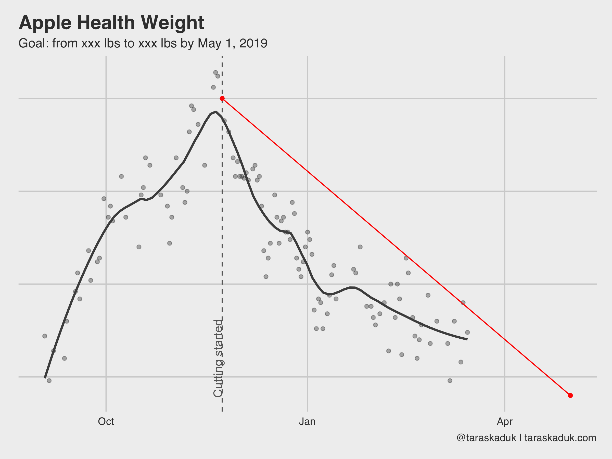

### More daily grain data
There many more charts you can build from this grain: your resting heart rate, walking heart rate, VO2Max, and anything else that can be summarized to a daily level.
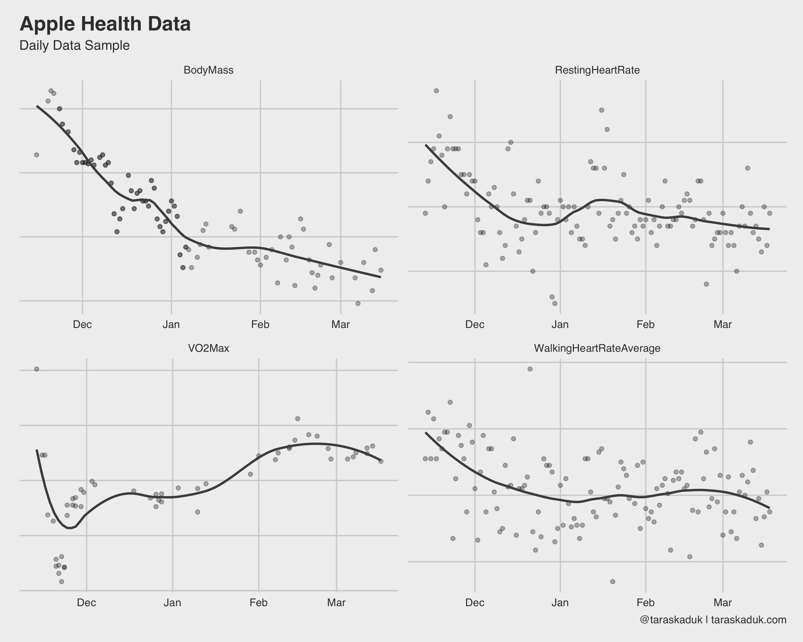

### Hourly grain

Some data is fun to see on an hourly grain. For example, step count and heart rate, when summarized to an hourly level, shows some cool stuff:

```r
df %>%
  filter(type %in% c('HeartRate', 'StepCount')) %>% 
  group_by(type, hour) %>% 
  summarise(value = mean(value)) %>% 
  ggplot(aes(x = hour, y = value, fill = value)) +
  geom_col() +
  scale_fill_continuous(low = 'grey70', high = "#008FD5") +
  scale_x_continuous(
    breaks = c(0, 6, 12, 18),
    label = c("Midnight", "6 AM", "Midday", "6 PM")
  ) +
  labs(title = "Apple Health Data",
       subtitle = "Hourly Data Sample",
       caption = '@taraskaduk | taraskaduk.com') +
  facet_wrap(~ type)+
  guides(fill=FALSE)
```

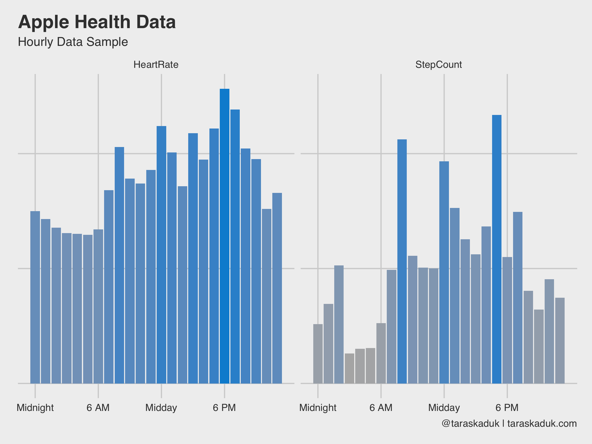

As these two charts nicely reveal, I have a sedentary job, I walk to work and from work, and walk around during my break, I work out after work (hence a slightly higher step count around 6 PM + higher heart rate).
Or, if we further break down the step count by day of the week, it will reveal that on weekend, I move a bit all the time, versus more concentrated activity on weekdays:

```r
df %>%
  filter(type == 'StepCount') %>% 
  group_by(date,wday,hour) %>% 
  summarize(steps=sum(value)) %>% 
  group_by(hour,wday) %>% 
  summarize(steps=sum(steps)) %>% 
  arrange(desc(steps)) %>%

  ggplot(aes(x=hour, y=wday,  fill=steps)) + 
    geom_tile(col = 'grey40') + 
    scale_fill_continuous(labels = scales::comma, low = 'grey95', high = '#008FD5') +
    theme(panel.grid.major = element_blank()) +
    scale_x_continuous(
      breaks = c(0, 6, 12, 18),
      label = c("Midnight", "6 AM", "Midday", "6 PM")
    ) +
    scale_y_reverse(
      breaks = c(1,2,3,4,5,6,7),
      label = c("Sunday", "Monday", "Tuesday", "Wednesday", "Thursday", "Friday", "Saturday")
    ) +
    labs(title = "Weekly Step Count Heatmap",
         caption = '@taraskaduk | taraskaduk.com') +
    guides(fill=FALSE)+
    coord_equal()
```


Same can be done with a "days X months" grid, or anything else - you name it.

### Calorie deficit and surplus

If you're tracking your meals in an app like MyFitnessPal, as well as having an Apple Watch, you can figure out your caloric surplus or deficit based on the data from your nutrition and your Apple Watch's basal and active energy readings.
The next chart goes a little something like this:

```r
energy <- df %>%
  filter(endDate >= '2018/11/24' & 
           date < '2018/12/30' & 
           type %in% c('BasalEnergyBurned', 'ActiveEnergyBurned', 'DietaryEnergyConsumed')) %>%
  select(date, type, value) %>% 
  group_by(date, type) %>% 
  summarise(value = sum(value)) %>% 
  ungroup()

ggplot() +
  geom_col(data = energy %>% 
             filter(type != "DietaryEnergyConsumed"),
             aes(x= date, y = value, fill = type)) +
  scale_fill_manual(values = c("BasalEnergyBurned" = "#3182bd", 
                               "ActiveEnergyBurned" = "#9ecae1", 
                               "DietaryEnergyConsumed" = "grey30")) +
  geom_col(data = energy %>% 
             filter(type == "DietaryEnergyConsumed"), 
             aes(x= date, y = value, fill = type),  width = 0.7, alpha = 0.6) +
  labs(title = "Calories Consumed & Burned",
       caption = '@taraskaduk | taraskaduk.com')

ggsave('energy1.png', width = 8, height = 6, units = "in")
```
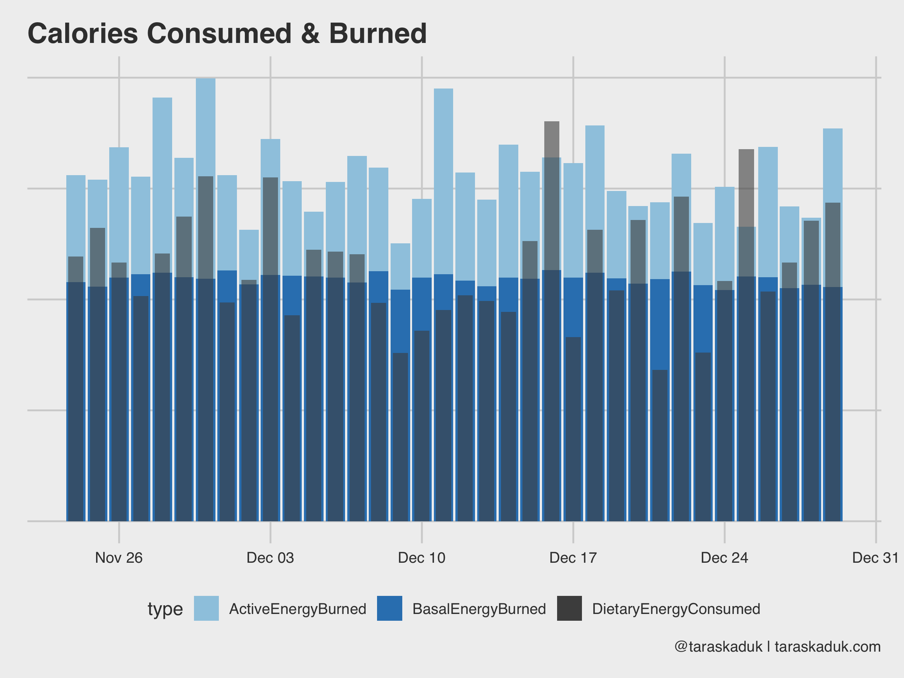

You can also calculate given deficit/surplus by a bit of data wrangling:

```r
energy_spread <- energy %>% 
  spread(type, value) %>% 
  mutate(EnergyBurned = ActiveEnergyBurned + BasalEnergyBurned,
         EnergyConsumed = DietaryEnergyConsumed,
         EnergyDeficit = EnergyBurned - EnergyConsumed,
         EnergyDeficitPct = EnergyDeficit / EnergyBurned,
         EnergyDeficitCat = if_else(EnergyDeficit > 0, 'Deficit', 'Surplus'))

energy_spread %>% 
  ggplot(aes(x= date, y = EnergyDeficitPct, fill = EnergyDeficitCat)) +
  geom_col() +
  scale_fill_manual(values = c("#1a9641", "#ca0020"))+
  labs(title = "Calorie deficit and surplus",
       caption = '@taraskaduk | taraskaduk.com')
```
(oh, hey, look, I overate a lot on Christmas!)

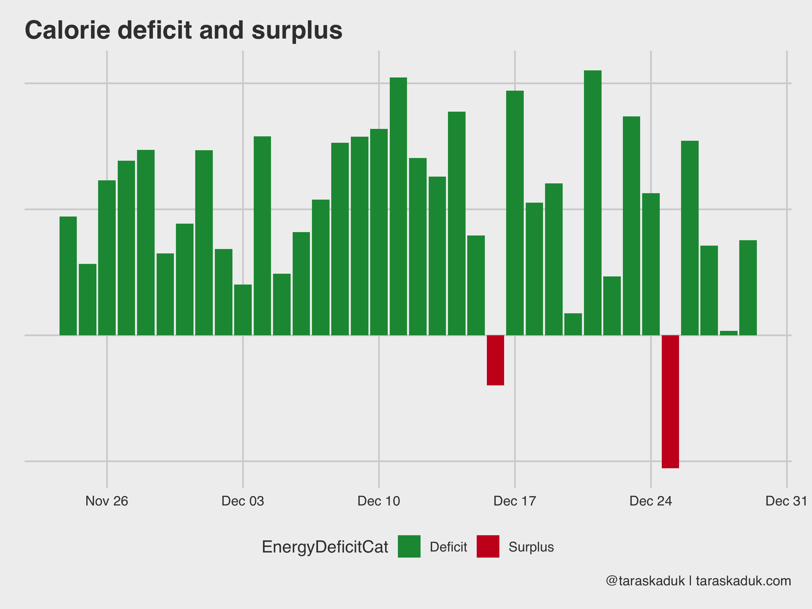

### Other dietary data

Speaking of nutrition data, you can track many various macros and micros directly from Apple Health if your nutrition tracking app is connected to it.

```r
df %>%
  filter(type %in% c('DietaryFatSaturated', 'DietaryProtein', 'DietaryCholesterol', 'DietaryPotassium')) %>% 
  mutate(type = str_remove(type, "Dietary")) %>% 
  group_by(type, date) %>% 
  summarise(value = sum(value)) %>% 
  
  ggplot(aes(x= date, y = value)) +
    geom_smooth(span = 0.7, alpha = 0.2, col = "grey30", se = FALSE) +
    geom_point(alpha = 0.5) +
    facet_wrap(~type, scales="free") +
    labs(title = "Nutrition Micros and Macros to Track",
         caption = '@taraskaduk | taraskaduk.com')
```

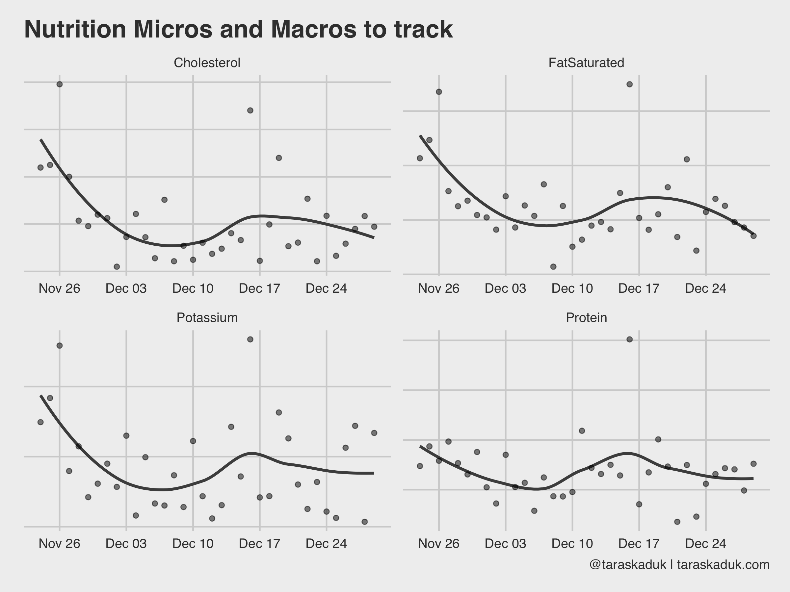

For example, you could plot your protein intake against your body weight and then visualize the percentage, if you're working out and need to ensure a specific amount of protein intake every day.

### Other external data: blood pressure
You can get many other things out of Apple Health data dump. For example, I use an OMRON blood pressure monitor, and it syncs the data to my Apple Health (or, I could enter the readings manually upon my health checkups if I didn't have a monitor at home). I later can extract this BP data and visualize it:

```r
blood_pressure <- df %>%
  filter(type %in% c('BloodPressureSystolic', "BloodPressureDiastolic")) %>% 
  mutate(type = str_remove(type, "BloodPressure")) %>% 
  select(value, type, date:hour) %>% 
  group_by_at(vars(-value)) %>% 
  summarise(value = mean(value)) %>% 
  mutate(morning = if_else(hour >=5 & hour <= 8, TRUE, FALSE),
         stage = factor(if_else(type == "Systolic",
                              case_when(value <  xxx ~ "Normal",
                                        value <  xxx ~ "Elevated",
                                        value <  xxx ~ "Hypertension 1",
                                        value <  xxx ~ "Hypertension 2",
                                        value >= xxx ~ "Hypertensive Crisis",
                                        TRUE ~ NA_character_),
                              case_when(value <  xxx ~ "Normal",
                                        value <  xxx ~ "Elevated",
                                        value <  xxx ~ "Hypertension 1",
                                        value <  xxx ~ "Hypertension 2",
                                        value >= xxx ~ "Hypertensive Crisis",
                                        TRUE ~ NA_character_)),
                      levels = c("Normal",
                                 "Elevated",
                                 "Hypertension 1",
                                 "Hypertension 2",
                                 "Hypertensive Crisis")))


blood_pressure  %>% 
  filter(morning == TRUE) %>% 
  ggplot(aes(x= date, y = value, group = type, col = stage)) +
  geom_smooth(span = 0.7, alpha = 0.4, col = "grey40", se = FALSE) +
  geom_point(size = 3, alpha = 0.7) + 
  scale_color_brewer(palette = "RdYlGn", direction = -1) +
  labs(title = "Blood pressure",
       subtitle = "Systolic and Diastolic",
       caption = '@taraskaduk | taraskaduk.com')
```

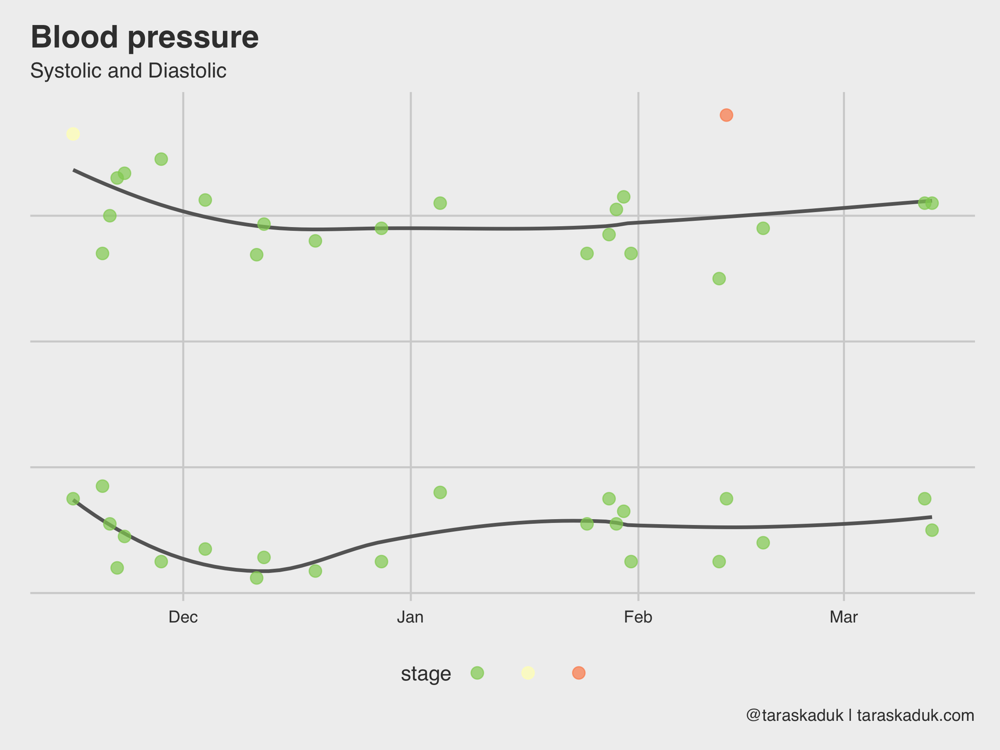


## Activity data frame

Another dataset in Apple Health is your Apple Watch's activity: Move, Exercise and Stand rings that you have daily.
The grain is daily, and there is a reading and a goal for each metric (kind of redundant for Stand and Exercise, as these goals don't change, but I guess it's easier that way). Looking at `str(df_activity)`:

```r
 'data.frame':	130 obs. of  8 variables:
 $ dateComponents        : Factor w/ 130 levels "2018-11-04","2018-11-05",..: 1 2 3 4 5 6 7 8 9 10 ...
 $ activeEnergyBurned    : Factor w/ 128 levels "0","1017.62",..: 1 1 1 48 19 96 99 30 110 31 ...
 $ activeEnergyBurnedGoal: Factor w/ 4 levels "0","760","770",..: 1 1 1 2 2 2 2 2 2 2 ...
 $ activeEnergyBurnedUnit: Factor w/ 1 level "kcal": 1 1 1 1 1 1 1 1 1 1 ...
 $ appleExerciseTime     : Factor w/ 75 levels "0","1","10","102",..: 1 1 1 22 73 44 40 7 38 4 ...
 $ appleExerciseTimeGoal : Factor w/ 1 level "30": 1 1 1 1 1 1 1 1 1 1 ...
 $ appleStandHours       : Factor w/ 12 levels "0","10","11",..: 1 1 1 3 8 7 8 7 6 7 ...
 $ appleStandHoursGoal   : Factor w/ 1 level "12": 1 1 1 1 1 1 1 1 1 1 ...
```

With a bit of data wrangling, you can do lots of cool stuff. I maxed out the acceptable amount of vanilla charts in this post, so let me do another tile chart again. This will require a bit of R code though, but stay with me here.

```r
#Some data clean up  and renaming here
df_activity_tidy <- df_activity %>% 
  select(-activeEnergyBurnedUnit) %>% 
  mutate_all(as.character) %>% 
  mutate(date = as.Date(dateComponents)) %>% 
  filter(date >= "2018-11-13") %>% 
  select(-dateComponents) %>% 
  mutate_if(is.character, as.numeric) %>% 
  rename(move = activeEnergyBurned,
         exercise = appleExerciseTime,
         stand = appleStandHours,
         move_goal = activeEnergyBurnedGoal,
         exercise_goal = appleExerciseTimeGoal,
         stand_goal = appleStandHoursGoal) %>% 
#Now, create 2 new metrics: percent of goal and a "Yes/No" flag.
  mutate(move_pct = move/move_goal,
         exercise_pct = exercise/exercise_goal,
         stand_pct = stand/stand_goal,
         move_bool = if_else(move_pct < 1, FALSE, TRUE),
         exercise_bool = if_else(exercise_pct < 1, FALSE, TRUE),
         stand_bool = if_else(stand_pct < 1, FALSE, TRUE))
```

I'll `gather` my data 3 times for each metric (and **won't** write a function, go tell @drob on me), and stitch it together to get a tall dataset.

```r
df_activity_tall_value <- df_activity_tidy %>% 
  select(date, Move = move, Exercise = exercise, Stand = stand) %>% 
  gather(category, value, -date)

df_activity_tall_pct <- df_activity_tidy %>% 
  select(date, Move = move_pct, Exercise = exercise_pct, Stand = stand_pct) %>% 
  gather(category, pct, -date)

df_activity_tall_bool <- df_activity_tidy %>% 
  select(date, Move = move_bool, Exercise = exercise_bool, Stand = stand_bool) %>% 
  gather(category, boolean, -date)
  
df_activity_tall <- df_activity_tall_value %>% 
  left_join(df_activity_tall_pct, by = c("date", "category")) %>% 
  left_join(df_activity_tall_bool, by = c("date", "category")) %>% 
  mutate(category = as_factor(category, levels = c("Move", "Exercise", "Stand")),
         month = ymd(paste(year(date), month(date), 1, sep = "-")),
         week = date - wday(date) + 1,
         wday = wday(date),
         day = day(date))
```

Now, I can visualize this in many different ways. I like the boolean metric, and so I'll use that:

```r
df_activity_tall %>% 
  ggplot(aes(x = wday, y = week, fill = boolean)) +
    geom_tile(col = "grey30", na.rm = FALSE) +
    theme(panel.grid.major = element_blank()) +
    scale_fill_manual(values = c("grey80", "#1a9641")) +
    facet_wrap(~ category) +
    coord_fixed(ratio = 0.15) +
    guides(fill=FALSE) +
    labs(title = "Apple Watch goals completion",
         caption = '@taraskaduk | taraskaduk.com') +
    theme(axis.text.x = element_blank())
```
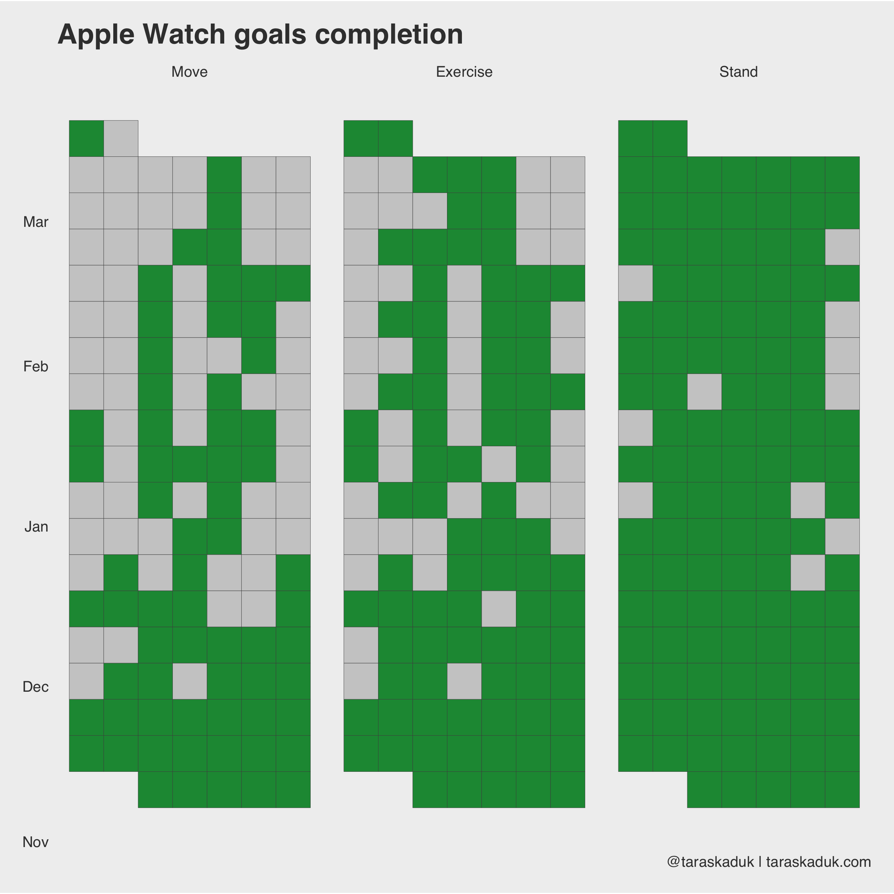

Or, I could match color to activity, but then I'd need to remove all `FALSE` values:
```r
df_activity_tall %>% 
  filter(boolean == TRUE) %>% 
  ggplot(aes(x = wday, y = week, fill = category)) +
    geom_tile(col = "grey50", na.rm = FALSE) +
    theme(panel.grid.major = element_blank()) +
    facet_wrap(~ category) +
    coord_fixed(ratio = 0.15) +
    guides(fill=FALSE) +
    labs(title = "Apple Watch goals completion",
         caption = '@taraskaduk | taraskaduk.com') +
    theme(axis.text.x = element_blank())
```

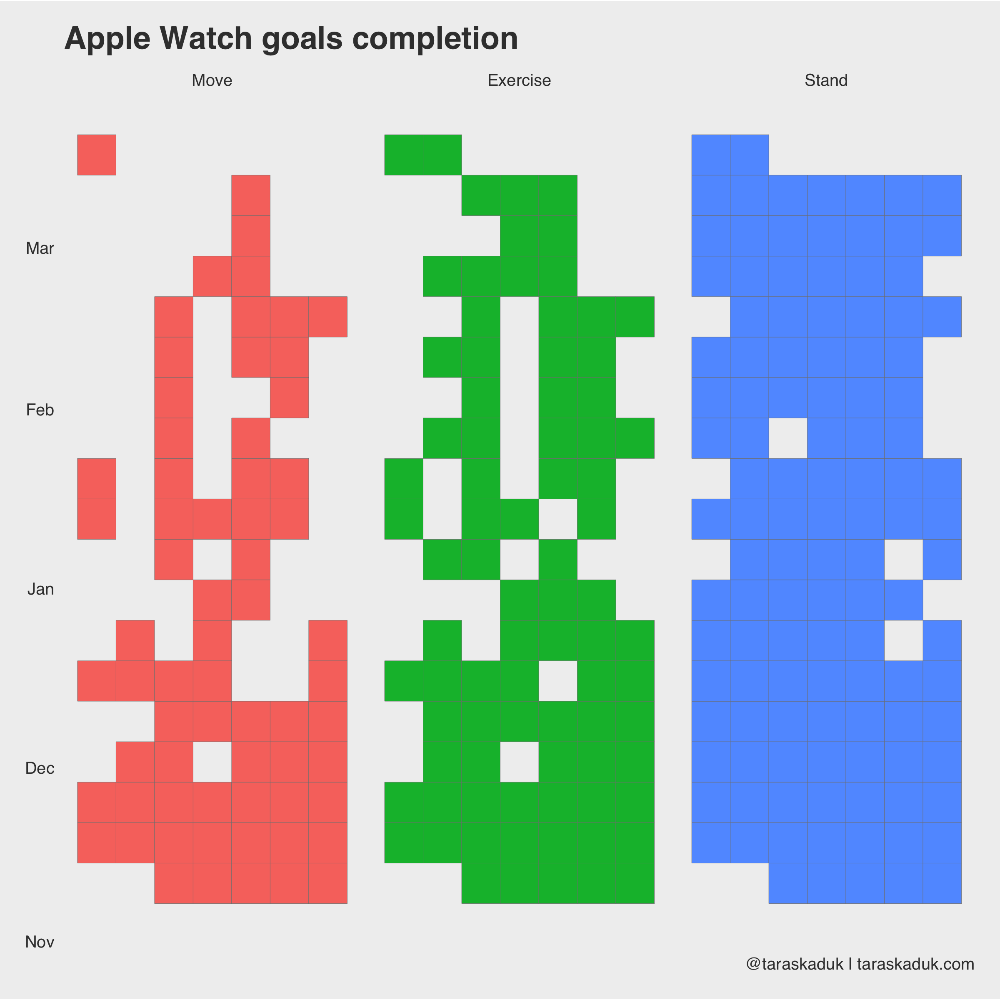


You can even do yourself a "Don't Break The Chain" tracker, adding data from other tables and other sources:


And since we're on the subject, you can do something like a streak count chart, seeing how long of a streak you can get:

```r
df_activity_streak <- df_activity_tall_bool %>% 
  mutate(category = as_factor(category, levels = c("Move", "Exercise", "Stand"))) %>% 
  arrange(category, date) %>% 
  group_by(category, 
           x = cumsum(c(TRUE, diff(boolean) %in% c(-1))),
           y = cumsum(c(TRUE, diff(boolean) %in% c(-1,1)))) %>% 
  mutate(streak = if_else(boolean == FALSE, 0L, row_number())) %>% 
  ungroup() 


ggplot(df_activity_streak, aes(x = date, y = streak, group = x, col = category)) +
  geom_line() +
  facet_grid(category~.) +
  guides(fill=FALSE) +
  labs(title = "Streak Count",
       caption = '@taraskaduk | taraskaduk.com')
```
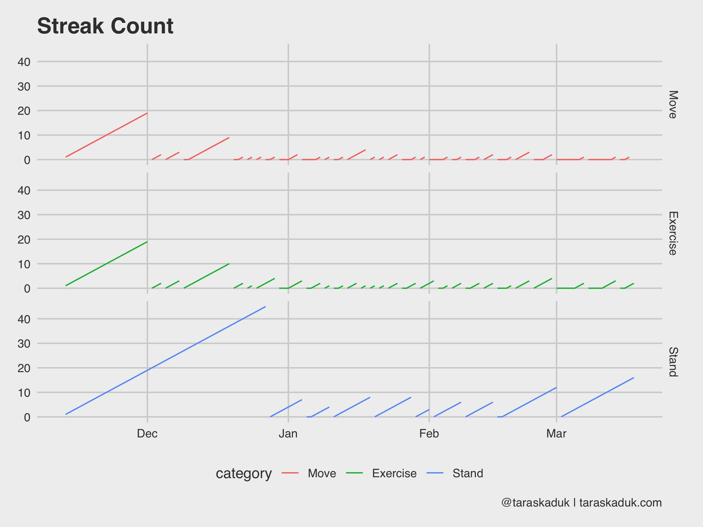

---

# Outro

If you're a health nut and an Mac-head like me and happen have an iPhone and an Apple Watch ⌚️ - chances are there is a lot of data sitting in your Health app. Whether you want to just play with it (as much as I hate this colloquialism - it is sometimes unavoidable), or use it with some purpose - it is really easy to dig into it. Hope this post will help you get statred, as well as provide some ideas for your own purposes. Feel free to share your charts, but don't forget to hide sensitive data (erasing a y-axis is a start)!