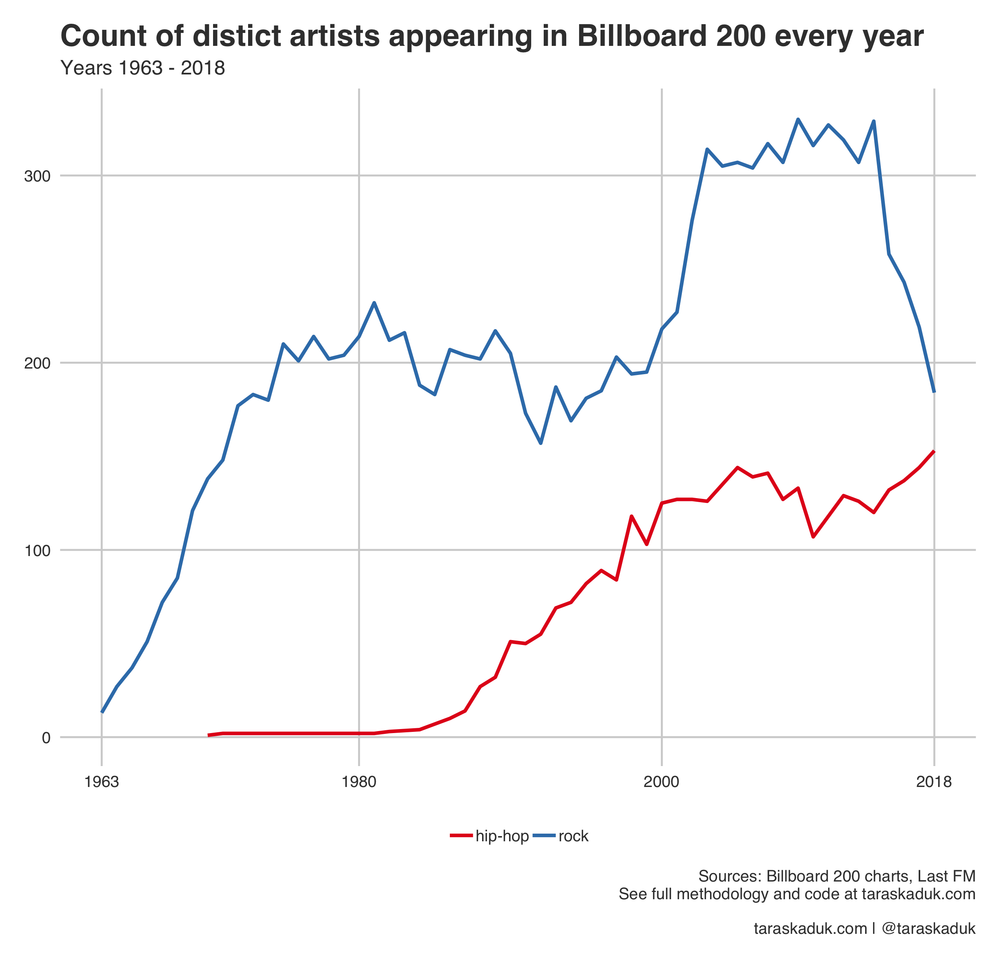
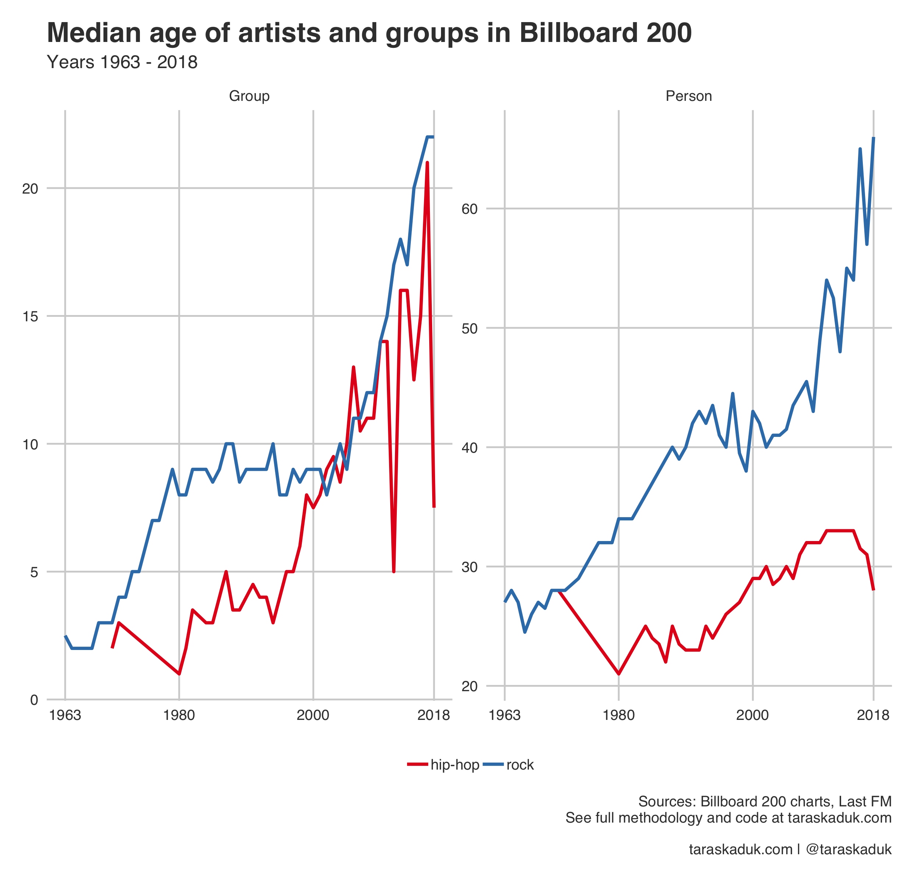

*"I'm a huge metal fan". Author unknown*

---

I've been a huge rock and metal fan my whole life. Most of the music that I listen to are some derivatives of rock, but mostly of a subcultural kind. I've been logging my listening habbits for over 11 years, so in case you are curious on the validity of my claims or the details of my tastes, you can check out [this post right here](https://taraskaduk.com/2019/10/11/lastfm/).

Anyway, I've been noticing a trend in my habits for the last few years: it seemed to me that I stopped discovering new artists and pretty much listen to the same old bands. At first, I thought it's all me to blame and I just get old. But then Finn McKenty, a guy that does reviews of subcultural music genres and various music bands on his YouTube channel "The Punk Rock MBA" (which I stan a lot), released this video titled "3 Reasons Why Rock is Dying", and it kind of made a lot of sense to me:



Regardless of the reasons Finn thinks rock is dying, it was a new thought for me - an idea that it's not that I only listen to the old bands, but that there aren't any new good bands to begin with.
In his video, Finn cites Billboard charts as one of the data sources. In fact, he kicks it off with a phrase "Let's look at the data", which is totally a call to action for me. I decided to take it up and investigate it properly: not by glancing over charts, but by getting the data and analazyng it.

I followed one of Finn's hunches looked at the Billboard 200 charts and payed attention to two specific metrics: how often does rock music appear in the charts, and what is the age of the artists.^[The discussion of whether or not rock and metal music, especially the niche subcultures at the extremes should even be concerned with making it to the Billboard 200 is beyond the scope of this analysis. Finn provides some thoughts on this in his video, BTW] To put the results in context, but keep it simple, I compared the data on rock with the same data on hip-hop - a music genre that we see rising more and more recently. Any other comnparisons didn't seem especially meaningful or interesting, and so I kept it to "Rock VS Hip-Hop" exclusively.

## Results

One thing immediatelly jumps out: rock's relevance in the mass market is really declining, while hip-hop is definitely on the rise. It is clear just from a sheer number of albums making it to the Billboard 200 (chart above). The picture is the same, no matter how differently we look at the data. 

Here is another chart, this time only looking at distinct count of artist by year (i.e. we are not counting every appearance of an album in every weekly chart, just any appearance of an artist in any given year at least once):

So, this part is clear. What about age though? Are the remaining artists that we see, are they getting older? Well, this one was not as easy to answer. The data that I have allows me to compute a __real__ age of individual artists and a __stage__ age of music groups.^[The issue was with the MusicBrainz API response on a start date of an artist: it provides a birth date for a person and a group start date for groups. I guess I could figure it out by getting every album release for every artist, and then figure out the earliest release date for each, but this is a task for too many API calls which I'm not comfotable with.] It would be more helpful to have start of career for both single artists and groups. But the best we can do with this data is to look at individual artists and groups separately^[I chose median age over mean age due to the fact that there is no upper bound on the data, and if an Elvis Prestley record made it to the chart today, we'd have to compute his age as of this year as 84 years old, as he'd be 84 years old when he became relevant again in Billboard 200]:

What we see is that both rock persons and groups are aging, and so are the hip-hop groups,^[although there aren't many hip-hop groups making the Billboard 200 to begin with, which explains the high variability. Most hip-hop acts are individual performers, while most rock acts are music bands] while individual hip-hop artists' age seems to be flatlining and perhaps even reversing. 

## Conclusion
So there we have it. Indeed, there are fewer and fewer rock artists making it to the Billboard 200, and the ones that do aren't exactly fresh blood. Of course, many subcultural genres I listen to never make it to charts like this to begin with, but the trend is visible even on the fringe.

It kind of bums me out a bit, as I wonder what will the new generations of young kids listen to. Hardcore punk, punk rock and metal music played a crucial role in my life, especially in my teenage years. It helped me channel my anger, my rebellious attitudes, helped me shape my goals, helped me grow. Pop music and hip-hop doesn't do that for me. And I know I've always been on the fringe in my music tastes, and we hardcore kids are a niche of a niche and a very small minority, but I still wonder what music will be there for the new kids to rebel to? God, I hope not the same old bands I love and admire.

---

## Methodology

I pulled the weekly Top 200 albums from 1963 through 2018 from https://components.one/datasets/billboard-200/. The data set is attributed to Andrew Thompson ([@asthompson](https://twitter.com/asthompson) on Twitter). 

Having the weekly 200 most popular albums, I was still missing the genres of the artists and the age. I got the start date for artists via [MusicBrainz](https://musicbrainz.org/) API. The API also provided the genre data, but it appeared to be missing many new artists, and giving me wrong genres on some. I then resorted to the [last.fm](https://www.last.fm/) API, which has the crowd-sourced data for artists' genres.

For each artist, I pulled the top 5 tags attributed to them, which is supposed to solve the difficulty in the genres taxonomy: most flavors of rock music will contain a "rock" tag in their top 5 tags most of the time, and same goes for other genres. (It does suggest that the same artist can be counted in more categories than one if we happen to compare data between genres. But this is not necessarily a bug, but a feature)

The R files and the data are over at https://github.com/taraskaduk/is-rock-dead (Sorry for the mess and no comments in the code, hope you can make sense of it)
