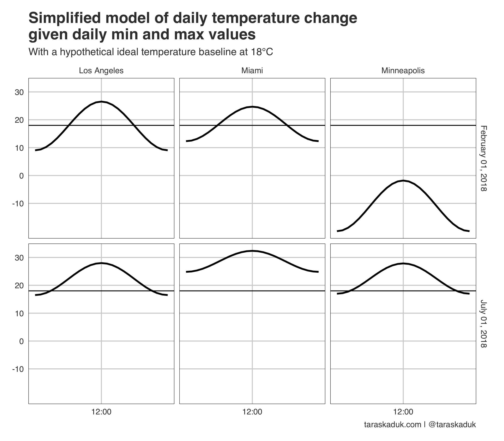
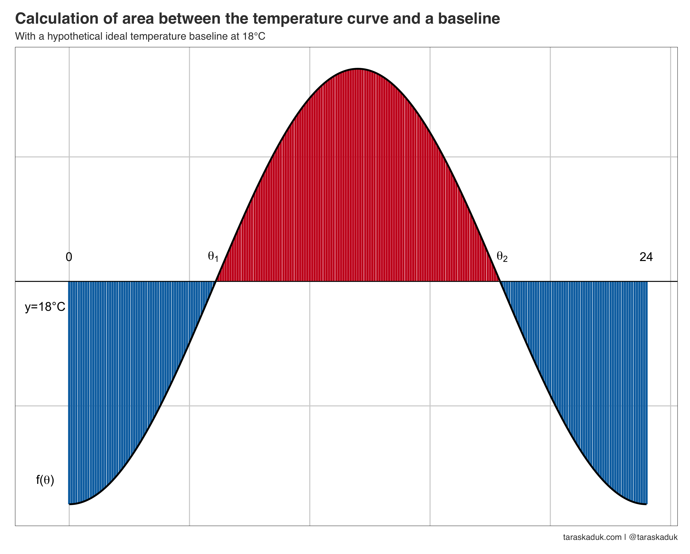
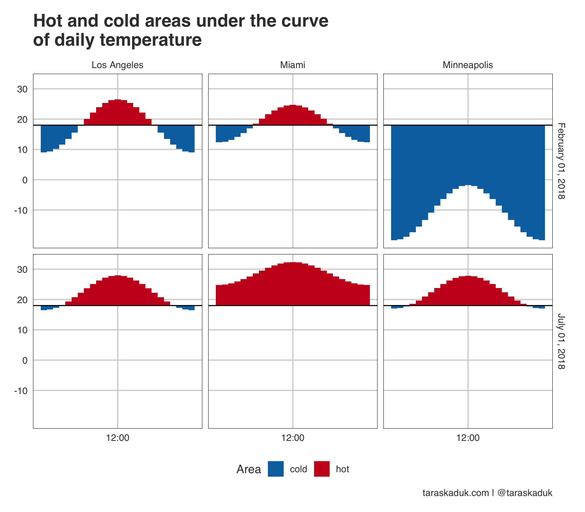
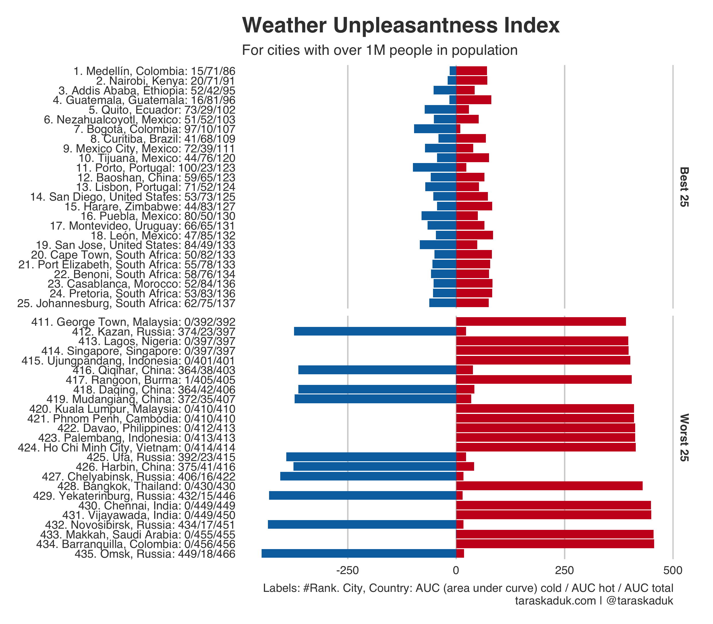
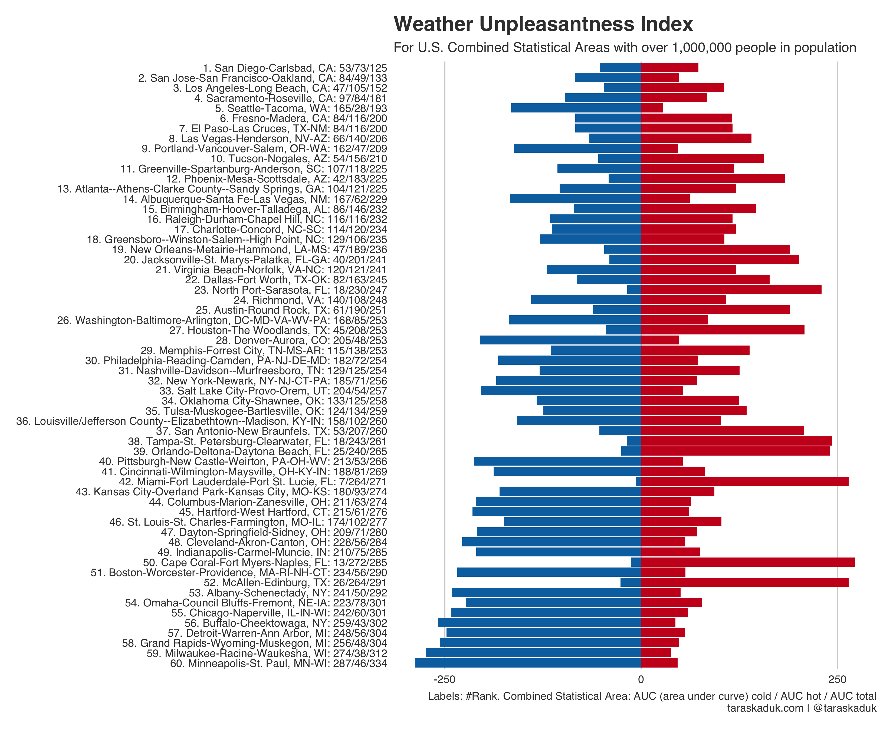
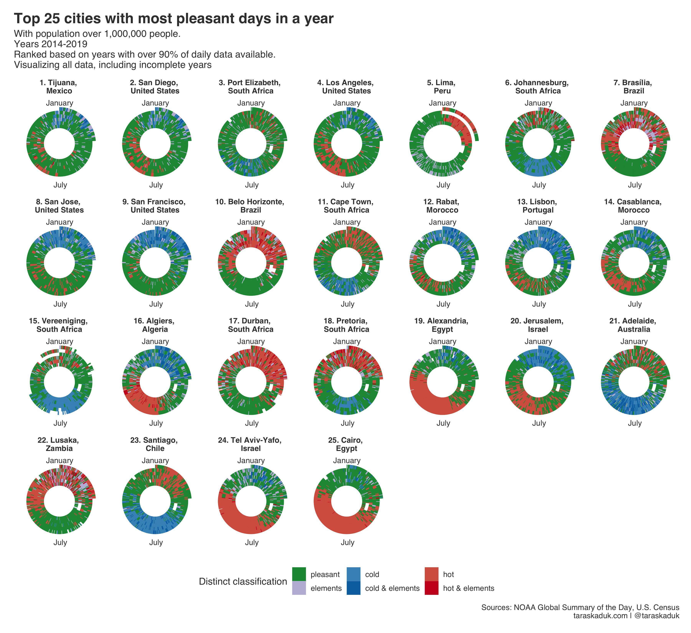
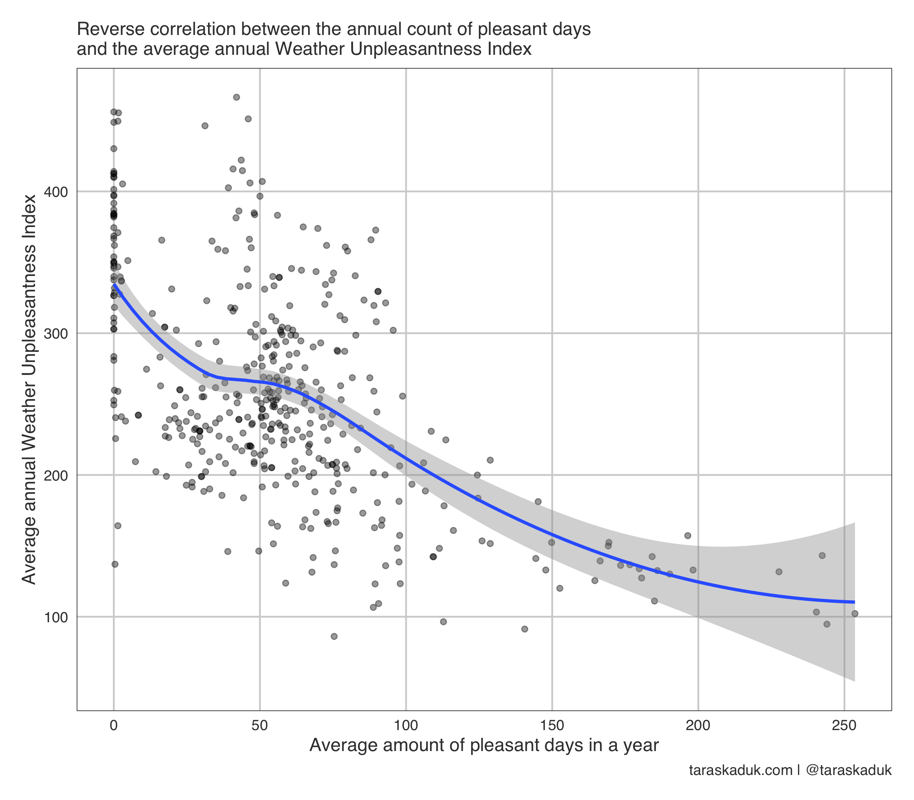

Ever since my analysis on [most pleasant places to live](https://taraskaduk.com/2019/02/18/weather/), I've been aware of some shortcomings of such analysis (and painfully reminded via a not so pleasant crowd over at Reddit [here](https://www.reddit.com/r/dataisbeautiful/comments/bybovm/us_cities_with_most_pleasant_weather_days_in_a/) and [here](https://www.reddit.com/r/dataisbeautiful/comments/byjies/top_25_world_cities_with_most_pleasant_days_in_a/)). Still, I had my 15 seconds of fame, with local and global resources sharing it, including [Digg.com](https://digg.com/2019/top-25-cities-most-pleasant-days-data-viz), [CBS Sacramento](https://sacramento.cbslocal.com/2019/04/30/sacramento-pleasant-weather/), [Revolution Analytics](https://blog.revolutionanalytics.com/2019/03/best-and-worst-weather.html) and a host of Reddit pages.
Despite all the heat I got for being subjective and picking arbitrary parameters, I wasn't alone. My analysis was inspired by an [map viz by Kelly Norton](https://kellegous.com/j/2014/02/03/pleasant-places/), and later I found similar articles with similar approaches over at [WaPo](https://www.washingtonpost.com/news/capital-weather-gang/wp/2018/08/07/the-united-states-of-nice-days-heres-where-and-when-to-find-the-nations-most-frequent-ideal-weather/#comments-wrapper) and [Zillow](https://www.zillow.com/research/pleasant-days-methodology-8513/). They all use pretty arbitrary parameters, but what else to do? Weather, after all, is subjective.

### Problems with past analysis
Still, I was thinking about how to improve this analysis a bit. There are a few items to consider:

- almost every weather metric as a function of pleasantness is rather quadratic than linear
  - a little wind is better than no wind, but a lot of wind is bad
  - the warmer the temp, the better, until it isn't, and then it's worse.
  - even a bit of relative humidity is better than 0 humidity, but 100% RH is not good.
- many metrics interact with each other, producing an amount of results that is next to impossible to quantify:
  - warm weather, no cloud cover and a bit of wind is nice
  - a bit warmer weather needs more cloud cover to stay nice. I.e. warm temp under direct sun light is not pleasant
  - a colder day calls for less or no cloud cover.
  - no wind, breeze or stronger wind changes every scenario for better or for worse, depending on other things.
- some metrics are less meaningful on a daily grain:
  - same amount of rain can ruin a day if it rains all day, or can be negligible, if it rains hard for a brief amount of time.

With all this in mind, I figured that the most reliable metric here is temperature (adjusted for RH to reflect Heat Index or adjusted for wind speed to reflect Wind Chill is also OK). But even here, we run into an issue of having at least 2 very different readings (min and max temp, as well as the mean in between): if it was 10°C at night and 35°C in the afternoon, was the day pleasant? Yes, it was at some point (or two points, actually), but not all day. However, my methodology (and methodology of other above-mentioned authors) is a "yes-no" system: either the day was pleasant, or it wasn't.

---
### The Temperature Unpleasantness Index, or TUI

Not to say that this methodology is wrong or bad, but it gave me some food for thought, and allowed me to come up with something I call a Temperature Unpleasantness Index or Weather Independence Index. 

_(And just to show how long it takes me to get stuff done, here is a tweet from **May** when I initially thought up the concept)_

{}

### Basic Assumptions

To explain how it works, we first must make a couple of assumptions and simplifications of our model (remember that "all models are wrong, but some of them are useful"):

- we will assume that the daily temperature follows a sinusoidal curve from its min value to its max value and back (simplifying from needing at least 24 readings a day to just 2)
- more specifically, we'll model the daily temperature as a cosine function, and will assume the minimum temperature at midnight and maximum temperature at noon (simplifying from computing these times using sunset, sunrise and solar noon times and shifting them accordingly):

$$f(\theta) = -a \cdot cos(b\theta) + d = -\frac{({t\_{max}} - {t\_{min}})}{2}\cdot cos(\frac{\pi}{12}\theta) + t\_{min} + \frac{(t\_{max}-t\_{min})}{2}$$

- we will accept, as a baseline, a pleasant daily temperature of 20°C and a pleasant night temperature of 16°C, all based on [Link 1](https://health.clevelandclinic.org/what-is-the-ideal-sleeping-temperature-for-my-bedroom/), [Link 2](https://www.sleep.org/articles/temperature-for-sleep/), [Link 3](https://www.huffingtonpost.com.au/2017/11/27/this-is-the-perfect-temperature-for-being-happy-and-social-study-finds_a_23288718/), [Link 4](http://www.city-data.com/forum/general-u-s/54730-what-your-ideal-outdoor-temperature-4.html), [Link 5](https://www.outsideonline.com/1784591/whats-best-temperature-productivity), [Link 6](https://www.reddit.com/r/askscience/comments/ulxdg/what_is_the_ideal_temperature_of_surroundings_for/) (I hope I made it clear that ideal temp is quite subjective, but as long as readers can agree that their ideal temperature is somewhere around close to these baseline numbers, the methodology should work, as you will see soon)
- we will furthermore simplify this to establish one baseline of 18°C instead of having 2 numbers (such move makes the model much simpler while delivering almost the same results)

**In other words, 18°C is an ideal baseline, any deviation up or down from which will make a human experience of outside temperature less favorable. Along the same lines, any deviation from 18°C up or down will also make humans rely on other advances of civilization: clothing, indoor insulation, heating, air conditioning, more clothing layers, more heating etc. Thus, the higher the Index, the less livable the place is, or the more reliant the place is on things like air conditioning or central heating.**

### TUI Calculation

With these basic assumptions in mind, and using 3 cities (Los Angeles, Miami, Minneapolis) at 2 specific dates (Feb 1 and Jul 1 of 2018) as examples, here are our next steps:

- We are going to model the temperature curve for each day of each location in the data set based on the above mentioned parameters

- We will then compute the area between the curve and the established 18°C baseline as a sum of three integrals:

$$TUI = \int\_{0}^{\theta\_1} (g(\theta) - f(\theta)) d\theta + \int\_{\theta\_1}^{\theta\_2} (f(\theta) - g(\theta)) d\theta + \int\_{\theta\_2}^{24} (g(\theta) - f(\theta)) d\theta$$

where \\(\theta\\) is time, \\(f(\theta)\\) is our cosine function, \\(g(\theta) = 18\\) (our ideal temp. baseline, a straight line) and \\(\theta\_1\\) and \\(\theta\_2\\) are the times at which the temperature curve crosses the baseline (the cases when the curve stays completely above or below the baseline are simpler cases that require only one integration)



- The result of the calculation - the area between the curve and the baseline - is a number from 0 to infinity that can be interpreted as the amount of unpleasantness in the weather on the given day.
  - The area above the baseline stands for the unpleasantness in a hot weather, and the area below the baseline - for cold weather.
  - The sum of absolute values of both hot and cold areas will represent the total unpleasantness index.

- The change from day to day can be visualized as follows:

- The average value of the year is that location's average unpleasantness index.

### Examples of TUI calculation

Here are some cities (population over 1,000,000 people) with lowest and highest indexes, based on past 5 years of data. The numbers on the label indicate cold/hot/total TUI, respectively:


The data for U.S. CSAs looks a bit more uniform. However, the most "unpleasant" (least livable) CSA with over 1 million people on the list - Minneapolis-St.Paul - is 2.5 times more unpleasant / less livable than the leader of the chart - San Diego-Carlsbad, CA.


Once again, we are talking about the cities strictly in temperature terms (adjusted for relative humidity and wind chill), and the baseline is picked somewhat arbitrarily (although not completely at random). I know people get opinionated and take the city rankings personally, but that's part of the fun, isn't it?

### Comparison to "Pleasant Days" analysis

One thing that stands out here is that the cities in both analyses are very similar. E.g. compare the list of top 25 world cities above with the following chart I posted on Reddit a while back:


Same goes for the the U.S. cities. In fact, there seems to be some correlation between the two approaches, even though one includes rain and snow and otherwise has a binary classification, while the other relies solely on temperature and rates every day on two separate scales.



---

## Code for obtaining AUC for TUI

Here is the R function to obtain the area between the temperature curve and the baseline.

```
get_auc <- function(min, max, perfect = 18) {
  # Construct a cosine function given min and max values for the day
  a <- (max - min) / 2 #amplitude
  period <- 24
  b <- 2 * pi / period
  d <- min + a
  
  # Here is the temperature function:
  temperature <- function(x) {
    -a * cos(b * x) + d
  }
  
  # Depending on wether or not the cosine crosses the baseline,
  # our integration can happen one of three ways:
  
  if (min >= perfect) {
    integral <-
      integrate(temperature, 0, 24)$value - perfect * 24 %>%
      round(2)
    area <- tibble(auc_hot = integral,
                   auc_cold = 0,
                   auc_total = integral)
    
  } else if (max <= perfect) {
    integral <- perfect * 24 - integrate(temperature, 0, 24)$value %>%
      round(2)
    
    area <- tibble(auc_hot = 0,
                   auc_cold = integral,
                   auc_total = integral)
    
  } else {
    intercept1 <- acos((d - perfect) / a) / b
    intercept2 <- (12 - intercept1) * 2 + intercept1
    
    integral1 <- perfect * intercept1 - integrate(temperature, 0, intercept1)$value
    integral2 <- integrate(temperature, intercept1, intercept2)$value - perfect * (intercept2 - intercept1)
    integral3 <- perfect * (24 - intercept2) - integrate(temperature, intercept2, 24)$value
    
    area <- tibble(
      auc_hot = round(integral2, 2),
      auc_cold = round(integral1 + integral3, 2),
      auc_total = round(integral1 + integral2 + integral3, 2)
    )
  }
  return(area)
}
```
