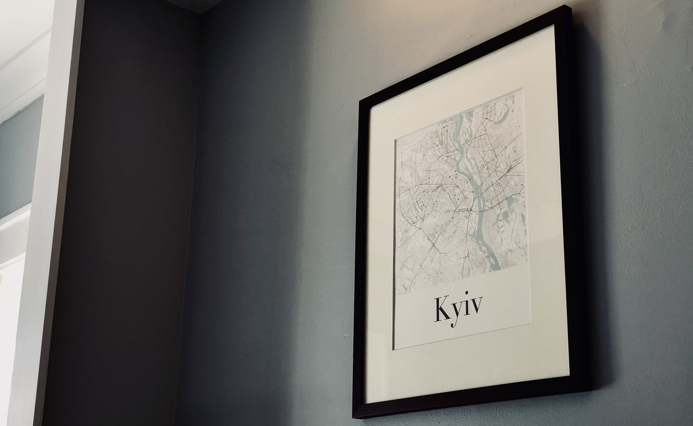
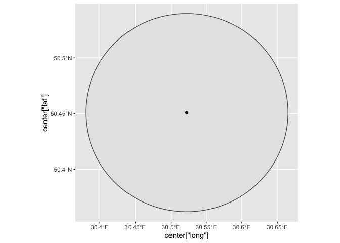
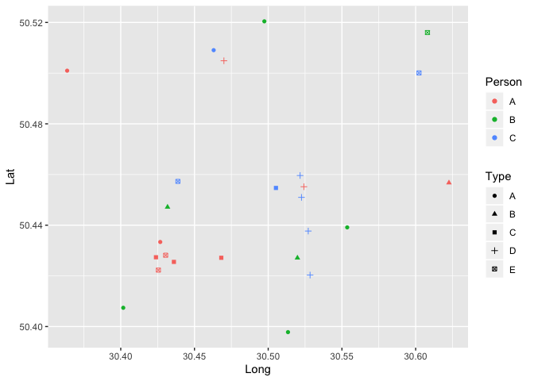
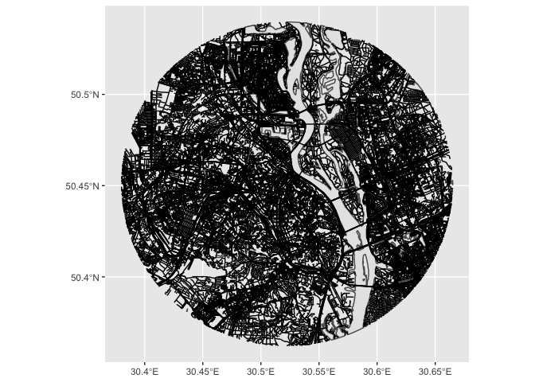

## Intro

This is a code that I used to print a map of Kyiv, Ukraine at home. Here is the final product: 

 

One important caveat here is that I want to come out upfront and say that I know nothing about what I’m doing. This is my first time working with shapefiles, and second time working with `sf` package. If some parts seems overly complicated or outright nonsensical to you — now you know why.

## Credit

The code here was heavily inspired by Erin Davis and their blogpost [“The Beautiful Hidden Logic of
Cities”](https://erdavis.com/2019/07/27/the-beautiful-hidden-logic-of-cities/). The GH repo with original code can be found here: <a href="https://github.com/erdavis1/RoadColors" class="uri">https://github.com/erdavis1/RoadColors</a>

## Code

Load packages first. `tidyverse` is my workhorse, and we'll need quite a number of `sf` functions.

```
library(sf)
library(tidyverse)
library(raster)
```

### Set up some parameters

Although I am confused about this step, I will put it here as is. I have zero idea why I need to declare two `crs` projections, and not one. This is the only way, however, that I could make things work. Don’t ask me any questions about it. If you can explain to me what I’m doing here and why - please, do.

``` 
# ESRI projection for mapping. 
# https://spatialreference.org/ref/esri/europe-albers-equal-area-conic/ for reference
crs1 <- 102013
crs2 <- 4326
```

### Download files

This is a major fork in the road, as you’ll need to source your shapefiles somewhere. As I was going to print a map of city that is not on anyone’s radar (literally), some of the easier ways of getting the necessary shapefiles were not available to me.

Your mileage will vary, but I hope the basic idea is clear: get the files that countain street, rail and water info.

``` r
url <- "http://download.geofabrik.de/europe/ukraine-latest-free.shp.zip"
curl::curl_download(url, destfile = "ukraine.shp.zip")
unzip("ukraine.shp.zip", exdir = "shapefiles")
```

``` r
setwd("shapefiles")
places_import <- read_sf(".", "gis_osm_places_a_free_1")
roads_import <- read_sf(".", "gis_osm_roads_free_1")
water_import <- read_sf(".", "gis_osm_water_a_free_1")
railways_import <- read_sf(".", "gis_osm_railways_free_1")
setwd("..")
```

### Finding borders

This is by far the most complicated part of the code. How to determine which part of these large shapefiles to print? In this case, I have roads, water and railways data for an entire country (the 2nd biggest country in Europe, nonetheless). There are just too many ways to go about this problem, and I’ll try to list a few solutions.

#### Scenario 1: Go by the city’s borders

Perhaps, the easiest approach is to go by the city’s (or metro area’s) borders. In the existing workflow, these are provided, I just needed to find what I wanted:

``` r
places_kyiv <- places_import %>%
  filter(osm_id == 421866) %>%
  dplyr::select()
```


#### Scenario 2: A circular map

This one is straight out of Erin Davis’ blog post. All we need is a center point and a radius (in m).

``` r
center <- c(long = 30.5224974,
            lat = 50.4508911)
dist <-  10000
circle <- tibble(lat = center["lat"], long = center["long"]) %>% 
  # Again, no clue why am I switching back and forth between projections.
  # But that's the only way I could make it work, following the source code from Erin Davis.
  st_as_sf(coords = c("long", "lat"), crs = crs2) %>%  
  st_transform(crs1) %>% 
  st_buffer(dist = dist) %>% 
  st_transform(st_crs(crs2))
```



#### Scenario 3.1: Rectangular map, known margins

To cut out a clear square or rectangle, there is a bit more work to do. The easiest way is if we know the margins — in that case, we only need to pass the marginal latitudes and longitudes to a `bbox` variable:

``` r
bbox <- c(xmin= your_lowest_lat, 
          ymin=your_leftmost_long, 
          xmax= your_highest_lat, 
          ymax= your_rightmost_long)
```

#### Scenario 3.2: Rectangular map, known center, known radius, unknown margins

If we know a desired center, and know (or guess) a radius, constructing a crop box becomes a matter of drawing a circle around the center, and then finding the tangents on each of four sides.

``` r
dist <-  10000
circle1 <- tibble(lat = center["lat"], long = center["long"]) %>% 
  st_as_sf(coords = c("long", "lat"), crs = crs2) %>%  
  st_transform(crs1) %>% 
  st_buffer(dist = dist) %>% 
  st_transform(st_crs(crs2))
bbox1 <- st_bbox(circle1)
```

An extra complication: if we don’t want a square, but a rectangular map. I wanted a 4:5 ratio. What to do? Draw another circle, and then use 2 data points from each to form a box.

``` r
circle2 <- tibble(lat = center["lat"], long = center["long"]) %>% 
  st_as_sf(coords = c("long", "lat"), crs = crs2) %>%  
  st_transform(crs1) %>% 
  st_buffer(dist = dist/0.8) %>% 
  st_transform(st_crs(crs2))
bbox2 <- st_bbox(circle2)
bbox <- c(bbox1$xmin, bbox2$ymin, bbox1$xmax, bbox2$ymax)
```

#### Scenario 3.3: Rectangular map, with points on the map (memorable places, landmarks, etc)

**This is the longest of all possible scenarios.**

If you are going to plot some personal data points on top, this is the time upload your data. Here is a sample I used:

``` r
points <- tibble::tribble(
             ~Place,      ~Lat,     ~Long, ~Type, ~Person,
            "Abcde", 50.433374, 30.426781,   "A",     "A",
            "Abcde", 50.500973,  30.36365,   "A",     "A",
            "Abcde", 50.456738, 30.622579,   "B",     "A",
            "Abcde", 50.427142, 30.468178,   "C",     "A",
            "Abcde", 50.427348, 30.423886,   "C",     "A",
            "Abcde", 50.425519, 30.436046,   "C",     "A",
            "Abcde", 50.504877, 30.469968,   "D",     "A",
            "Abcde", 50.455176, 30.524202,   "D",     "A",
            "Abcde",  50.42226, 30.425524,   "E",     "A",
            "Abcde", 50.428142, 30.430448,   "E",     "A",
            "Abcde", 50.439139, 30.553577,   "A",     "B",
            "Abcde",  50.40741, 30.401694,   "A",     "B",
            "Abcde", 50.520441,  30.49738,   "A",     "B",
            "Abcde", 50.397799, 30.513417,   "A",     "B",
            "Abcde", 50.447156, 30.431727,   "B",     "B",
            "Abcde", 50.427097, 30.519814,   "B",     "B",
            "Abcde", 50.516017,  30.60801,   "E",     "B",
            "Abcde", 50.509067,  30.46301,   "A",     "C",
            "Abcde", 50.454697, 30.505255,   "C",     "C",
            "Abcde", 50.450976, 30.522568,   "D",     "C",
            "Abcde", 50.420312, 30.528391,   "D",     "C",
            "Abcde", 50.459616, 30.521638,   "D",     "C",
            "Abcde", 50.437684, 30.527156,   "D",     "C",
            "Abcde", 50.457284, 30.438777,   "E",     "C",
            "Abcde", 50.500091, 30.602264,   "E",     "C"
            )
points_sf <- points %>% 
  st_as_sf(coords = c("Long", "Lat"), crs = crs2)
```

``` r
ggplot(points, aes(x = Long, y = Lat, col = Person, shape = Type)) +
  geom_point()
```



Another thing that we need to do now is to make sure that all points fit inside the printed map. We’re going to find the limits on all sides. Out of curiocity, we also can find the center of such map.

``` r
top <- max(points$Lat)
bottom <- min(points$Lat)
left <- min(points$Long)
right <- max(points$Long)

center <- c(long = (right - left)/2 + left,
            lat = (top - bottom)/2 + bottom)
```

My appoach is slightly different and more complicated though. I have a predetermined center in mind (and I assume you will as well), but I also want to make sure all of my points fit in the map, while center remains center. I need to find the longest of four distances from the center to the top, bottom, left, and right, and use that as my new length. I also will be adding an extra kilometer to the distance to have the furthest point not completely on the edge of the map

``` r
center <- c(long = 30.5224974,
            lat = 50.4508911)

top1 <- pointDistance(center, c(center["long"], top), lonlat = TRUE)
bottom1 <- pointDistance(center, c(center["long"], bottom), lonlat = TRUE)
right1 <- pointDistance(center, c(right, center["lat"]), lonlat = TRUE)
left1 <- pointDistance(center, c(left, center["lat"]), lonlat = TRUE)

dist <- max(top1,
            bottom1, 
            right1, 
            left1) + 1000 
```

Now that we have a center and a radius, we can draw the box the same way we did in Scenario 3.2.

``` r
circle1 <- tibble(lat = center["lat"], long = center["long"]) %>% 
  st_as_sf(coords = c("long", "lat"), crs = crs2) %>%  
  st_transform(crs1) %>% 
  st_buffer(dist = dist) %>% 
  st_transform(st_crs(crs2))
bbox1 <- st_bbox(circle1)

circle2 <- tibble(lat = center["lat"], long = center["long"]) %>% 
  st_as_sf(coords = c("long", "lat"), crs = crs2) %>%  
  st_transform(crs1) %>% 
  st_buffer(dist = dist/0.8) %>% 
  st_transform(st_crs(crs2))
bbox2 <- st_bbox(circle2)
bbox <- c(bbox1$xmin, bbox2$ymin, bbox1$xmax, bbox2$ymax)
```

### Cutting the map

With borders determined (one of several ways above), we are ready to crop the map to its desired size. If we’ve been cutting out a rectangular shape, we can use a `st_crop()` function to crop the shapefiles. Otherwise, we’ll need `st_intersection()`

If you want to you the city/metro/district/etc borders, the code and the initial output will look something like this:

``` r
roads_cropped <- st_intersection(roads_import, places_kyiv)
water_cropped <- st_intersection(water_import, places_kyiv)
railways_cropped <- st_intersection(railways_import, places_kyiv)
```


A circle crop will have a very similar code, and will most likely run much faster:

``` r
roads_cropped <- st_intersection(roads_import, circle)
water_cropped <- st_intersection(water_import, circle)
railways_cropped <- st_intersection(railways_import, circle)
```



A rectangular crop will have a slightly different code, as mentioned before, and will run even faster:

``` r
water_cropped <- st_crop(water_import, bbox)
roads_cropped <- st_crop(roads_import, bbox)
railways_cropped <- st_crop(railways_import, bbox)
```


### Roads cleanup

One thing you may want to do is clean up one of your shapefiles. Your mileage will vary. Here are some of the changes I made to the streets of Kyiv: I removed some streets and pathways of the least importance, united road links/junctions with their respective road classes, separated all the remaining streets of lower importance into its own “other” class, and then ordered them by meaning.

``` r
roads_cleaned <- roads_cropped %>% 
  filter(!(fclass  %in% c("steps", "footway", "living_street"))) %>%
  mutate(newclass = str_replace(fclass, "_link", ""),  
         newclass = if_else(newclass %in% c('trunk', 'primary', 'secondary', 'tertiary'), newclass, 'other'),
         newclass = factor(newclass, levels = rev(c('trunk', 'primary', 'secondary', 'tertiary', 'other')))) 
```

### Plotting

Now, to the plotting. This is where most of the tweaking is going to happen. Pick colors, opacity, width of the streets, order of layers etc etc. At some point, I wrote a double-layered `for` loop to iterate over several shades of grey and several versions of street widths, generating 64 different chart combinations. And that’s just for 2 parameters alone with values very close to one another! The possibilities here are endless.

Here is my final version:

``` r
theme_set(theme_void())

ggplot() +
  # Plot water first, layer the rest on top
  geom_sf(data = water_cropped, fill = "#d1e9eb", size = 0.01) +
  geom_sf(data = railways_cropped, col = "grey60", size = 0.1) +
  # First plot the small streets, in lighter grey and a bit thiner
  geom_sf(
    data = roads_cleaned %>% filter(newclass == "other"),
    color = "grey50",
    size = 0.1
  ) +
  # Layer all major roads on top, a bit bolder, a bit darker
  geom_sf(
    data = roads_cleaned %>% filter(newclass != "other"),
    color = "grey40",
    size = 0.2
  ) +
  # Add favorite/memorable places
  geom_sf(
    data = points_sf,
    aes(#size = Size,
        col = Person),
    alpha = 0.8,
    size = 2
  ) +
  labs(caption = 'Kyiv') +
  scale_color_manual(values = c(
    "A" = "#0571b0",
    "B" = "#ca0020",
    "C" = "#5e3c99"
  )) +
  theme(legend.position = "none",
        plot.caption = element_text(color = "grey20", 
                                    size = 142, 
                                    hjust = .5, 
                                    face = "plain", 
                                    family = "Didot")
                                    )
```

And, of course, save the plot on hard drive to printing.

```
ggsave("map.png", width = 297, height = 420, units = "mm", dpi = "retina")
ggsave("map.svg")
```


This is pretty much it! Enjoy!
